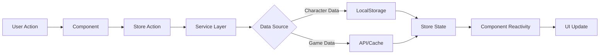
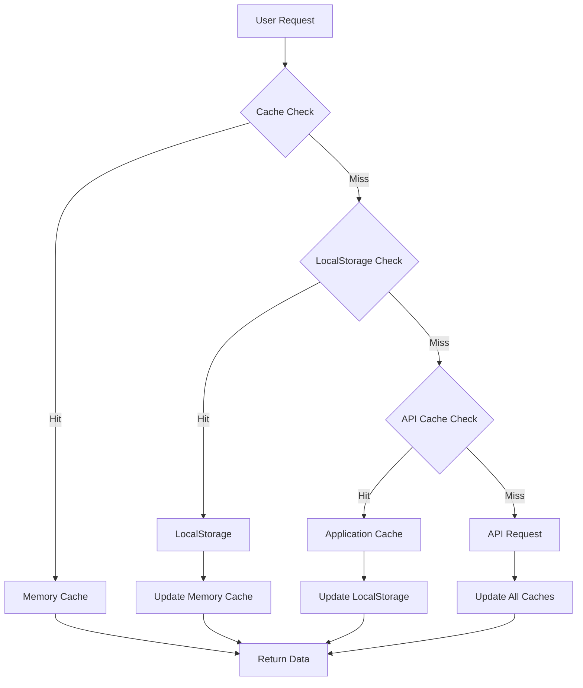
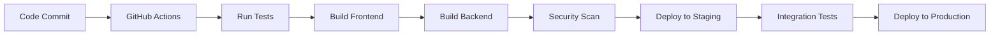

# Application Architecture

## Overview

TinkerTools is architected as a modern single-page application (SPA) with a modular, feature-based structure. The architecture emphasizes client-side data processing, real-time calculations, and seamless user experience across six specialized gaming utilities.

## Architectural Principles

### 1. Client-Centric Design
- **Data Storage**: All character data stored in browser LocalStorage
- **Processing**: Complex calculations performed client-side
- **Privacy**: No server-side storage of personal character information
- **Performance**: Minimal server round-trips for real-time operations

### 2. Modular Architecture
- **Feature-based organization**: Each tool (TinkerPlants, TinkerFite, etc.) as independent modules
- **Shared core services**: Common functionality across all tools
- **Plugin-style extensions**: Easy to add new tools or features
- **Loose coupling**: Tools can operate independently

### 3. Progressive Enhancement
- **Core functionality**: Works without JavaScript (basic item viewing)
- **Enhanced experience**: Full interactivity with JavaScript enabled
- **Mobile-responsive**: Adapts to all screen sizes
- **Offline capable**: Works without internet connection for cached data

## System Architecture Diagram

```mermaid
graph TB
    subgraph "Client Browser"
        UI[Vue 3 Frontend]
        Store[Pinia State Management]
        Cache[Application Cache]
        LS[LocalStorage]
        
        subgraph "TinkerTools Modules"
            TP[TinkerPlants]
            TF[TinkerFite]
            TN[TinkerNanos]
            TNu[TinkerNukes]
            TPo[TinkerPocket]
            TI[TinkerItems]
        end
    end
    
    subgraph "Server Infrastructure"
        API[FastAPI Backend]
        DB[(PostgreSQL)]
        CDN[Static Assets CDN]
    end
    
    UI --> Store
    Store --> Cache
    Store --> LS
    
    TP --> Store
    TF --> Store
    TN --> Store
    TNu --> Store
    TPo --> Store
    TI --> Store
    
    UI <--> API
    API <--> DB
    UI <-- CDN
```

## Frontend Architecture

### Core Structure
```
src/
├── main.ts                 # Application entry point
├── App.vue                 # Root component
├── router/                 # Vue Router configuration
├── stores/                 # Pinia state management
├── components/             # Shared components
├── composables/            # Vue 3 composition utilities
├── services/               # API and data services
├── utils/                  # Utility functions
├── types/                  # TypeScript type definitions
└── features/               # Feature-based modules
    ├── character/          # Character management
    ├── items/              # Item database
    ├── nanos/              # Nano programs
    ├── symbiants/          # Symbiant data
    ├── tinker-plants/      # Equipment optimization
    ├── tinker-fite/        # Combat simulation
    ├── tinker-nanos/       # Nano management
    ├── tinker-nukes/       # Damage calculation
    ├── tinker-pocket/      # Boss tracking
    └── tinker-items/       # Item database interface
```

### Feature Module Structure
Each feature module follows a consistent pattern:

```
features/tinker-plants/
├── index.ts                # Module entry point and routes
├── components/             # Feature-specific components
│   ├── EquipmentOptimizer.vue
│   ├── StatCalculator.vue
│   └── BuildComparison.vue
├── composables/            # Feature-specific composables
│   ├── useStatCalculations.ts
│   ├── useEquipmentOptimization.ts
│   └── useCharacterSimulation.ts
├── services/               # Feature-specific services
│   ├── optimizationEngine.ts
│   └── calculationWorker.ts
├── stores/                 # Feature-specific state
│   └── tinkerPlantsStore.ts
├── types/                  # Feature-specific types
│   └── optimization.ts
└── utils/                  # Feature-specific utilities
    ├── statCalculations.ts
    └── equipmentRules.ts
```

## State Management Architecture

### Pinia Store Structure
```typescript
// Global stores
├── useAppStore()           # Application-wide state
├── useCharacterStore()     # Character profile management
├── useItemsStore()         # Items database cache
├── useNanosStore()         # Nanos database cache
└── useSymbiantsStore()     # Symbiants database cache

// Feature-specific stores
├── useTinkerPlantsStore()  # Equipment optimization state
├── useTinkerFiteStore()    # Combat simulation state
├── useTinkerNanosStore()   # Nano management state
├── useTinkerNukesStore()   # Damage calculation state
├── useTinkerPocketStore()  # Boss tracking state
└── useTinkerItemsStore()   # Item search state
```

### Data Flow Pattern


## Backend Architecture

### API Layer Structure
```
api/
├── main.py                 # FastAPI application entry
├── routers/                # API route modules
│   ├── items.py           # Items endpoints
│   ├── nanos.py           # Nanos endpoints
│   ├── symbiants.py       # Symbiants endpoints
│   └── preferences.py     # User preferences
├── services/               # Business logic
│   ├── item_service.py
│   ├── nano_service.py
│   └── search_service.py
├── models/                 # Database models
│   ├── item.py
│   ├── nano.py
│   └── symbiant.py
├── schemas/                # Pydantic schemas
│   ├── item_schemas.py
│   ├── nano_schemas.py
│   └── response_schemas.py
├── database/               # Database configuration
│   ├── connection.py
│   └── migrations/
└── utils/                  # Utilities
    ├── cache.py
    └── search.py
```

### API Design Patterns

#### RESTful Endpoints
```typescript
// Items API
GET    /api/v1/items                    # List items with filtering
GET    /api/v1/items/{id}               # Get specific item
GET    /api/v1/items/search             # Advanced search
GET    /api/v1/items/suggest            # Autocomplete suggestions

// Nanos API
GET    /api/v1/nanos                    # List nanos with filtering
GET    /api/v1/nanos/{id}               # Get specific nano
GET    /api/v1/nanos/search             # Advanced search
GET    /api/v1/nanos/by-school          # Group by nano school

// Symbiants API
GET    /api/v1/symbiants                # List symbiants
GET    /api/v1/symbiants/bosses         # List unique bosses
GET    /api/v1/symbiants/locations      # List locations

// User Preferences API
GET    /api/v1/preferences              # Get user preferences
PUT    /api/v1/preferences              # Update preferences
```

#### Response Format Standard
```typescript
interface ApiResponse<T> {
  data: T;
  meta: {
    total?: number;
    page?: number;
    pageSize?: number;
    filters?: Record<string, any>;
  };
  status: 'success' | 'error';
  message?: string;
}
```

## Data Processing Architecture

### Client-Side Calculation Engine
```typescript
// Core calculation services
├── StatCalculationEngine   # Real-time stat calculations
├── EquipmentOptimizer     # Equipment optimization algorithms
├── CombatSimulator        # Combat damage simulation
├── NanoEffectsProcessor   # Nano effects calculation
└── CharacterProfiler      # Character profile management
```

### Web Workers for Heavy Calculations
```typescript
// Background processing workers
├── optimizationWorker.ts   # Equipment optimization
├── simulationWorker.ts     # Combat simulation
├── calculationWorker.ts    # Stat calculations
└── searchWorker.ts         # Search indexing
```

## Caching Strategy

### Multi-Level Caching


### Cache Implementation
```typescript
interface CacheManager {
  // Memory cache (JavaScript Map)
  memoryCache: Map<string, CacheEntry>;
  
  // LocalStorage cache (persistent)
  localStorageCache: LocalStorageManager;
  
  // Application cache (session-based)
  applicationCache: Map<string, CacheEntry>;
  
  // Cache operations
  get(key: string): Promise<any>;
  set(key: string, value: any, ttl?: number): Promise<void>;
  invalidate(pattern: string): Promise<void>;
  clear(): Promise<void>;
}
```

## Security Architecture

### Client-Side Security
- **Input Validation**: All user inputs validated and sanitized
- **XSS Prevention**: Vue 3's built-in XSS protection
- **CSRF Protection**: Token-based CSRF protection for API calls
- **Data Encryption**: Sensitive LocalStorage data encrypted

### API Security
- **CORS Configuration**: Proper CORS headers for domain restrictions
- **Rate Limiting**: API rate limiting to prevent abuse
- **Input Validation**: Pydantic schemas for request validation
- **SQL Injection Prevention**: SQLAlchemy ORM with parameterized queries

## Performance Architecture

### Frontend Optimization
```typescript
// Performance strategies
├── Code Splitting          # Route-based code splitting
├── Lazy Loading           # Component lazy loading
├── Virtual Scrolling      # Large dataset rendering
├── Memoization           # Computed property caching
├── Web Workers           # Background processing
└── Service Workers       # Offline capability
```

### Database Optimization
- **Indexing Strategy**: Strategic indexes on frequently queried fields
- **Query Optimization**: Optimized SQL queries with explain plans
- **Connection Pooling**: Database connection pooling for efficiency
- **Query Result Caching**: Application-level query result caching

## Monitoring & Observability

### Frontend Monitoring
```typescript
interface MonitoringService {
  // Performance metrics
  trackPageLoad(route: string, duration: number): void;
  trackUserInteraction(action: string, duration: number): void;
  trackError(error: Error, context: any): void;
  
  // Usage analytics
  trackFeatureUsage(feature: string, metadata: any): void;
  trackCalculationPerformance(type: string, duration: number): void;
}
```

### Backend Monitoring
- **API Response Times**: Track all endpoint response times
- **Database Query Performance**: Monitor slow queries
- **Error Rates**: Track API error rates and types
- **Resource Usage**: Monitor CPU, memory, and database connections

## Deployment Architecture

### Build Pipeline


### Production Environment
```
Digital Ocean App Platform
├── Frontend Service        # Vue 3 SPA served as static files
├── API Service            # FastAPI backend service
├── Database Service       # Managed PostgreSQL
├── Static Assets          # CDN for images/icons
└── Load Balancer         # Traffic distribution
```

## Scalability Considerations

### Horizontal Scaling
- **Stateless API Design**: API servers can be horizontally scaled
- **Database Read Replicas**: Read replicas for improved query performance
- **CDN Distribution**: Global CDN for static asset delivery
- **Client-Side Processing**: Reduces server load by processing data client-side

### Vertical Scaling
- **Database Optimization**: Query optimization and indexing strategies
- **Memory Management**: Efficient memory usage in both frontend and backend
- **Connection Pooling**: Optimal database connection management
- **Caching Layers**: Multiple caching layers to reduce database load

## Development Workflow

### Feature Development Process
1. **Feature Planning**: Define requirements and acceptance criteria
2. **API Design**: Design API endpoints and data schemas
3. **Frontend Development**: Implement UI components and state management
4. **Backend Development**: Implement API endpoints and business logic
5. **Integration Testing**: Test frontend-backend integration
6. **Performance Testing**: Validate performance requirements
7. **Code Review**: Peer review and quality assurance
8. **Deployment**: Deploy to staging and production environments

### Testing Strategy Integration
- **Unit Tests**: Individual component and function testing
- **Integration Tests**: Feature-level integration testing
- **E2E Tests**: End-to-end user workflow testing
- **Performance Tests**: Load testing and performance validation
- **Security Tests**: Security vulnerability scanning

This architecture provides a robust, scalable, and maintainable foundation for TinkerTools while ensuring optimal performance for the complex calculations and data management required by the six specialized gaming applications.