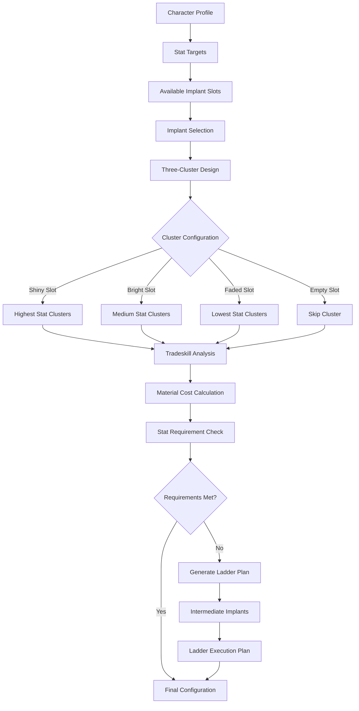

# TinkerPlants - Implant & Symbiant Planning Tool

## Overview

TinkerPlants is a specialized tool for planning and optimizing implant and symbiant configurations for Anarchy Online characters. It focuses on the complex mechanics of implant clustering, symbiant selection, tradeskill requirements for building implants, and the stat/treatment requirements for equipping finished implants.

## Core Functionality

### 1. Implant Planning & Optimization
- **Three-Cluster System**: Plan implants with Shiny (highest), Bright (medium), and Faded (lowest) cluster configurations
- **Cluster Flexibility**: Any cluster slot can remain empty, all slots are allowed to be filled
- **Tradeskill Planning**: Calculate tradeskill requirements and materials needed to build implants
- **QL (Quality Level) Planning**: Determine optimal implant quality levels based on character capabilities
- **Requirement Analysis**: Validate stat and treatment requirements for equipping finished implants
- **Laddering Strategy**: Plan intermediate implants to boost stats for final target implants

### 2. Symbiant Integration
- **Symbiant Selection**: Choose optimal symbiants for character build goals
- **Slot Conflict Resolution**: Handle conflicts between implants and symbiants
- **Boss Location Planning**: Plan symbiant farming based on boss locations and accessibility
- **Quality Progression**: Plan symbiant upgrades over character progression
- **Unit Type Optimization**: Choose between different symbiant unit types

### 3. Advanced Planning Features
- **Stat Target Achievement**: Plan implants/symbiants to reach specific stat goals
- **Progression Planning**: Plan implant/symbiant upgrades as character levels
- **Laddering Sequences**: Identify intermediate implants for stat bootstrapping
- **Build Comparison**: Compare different implant/symbiant configurations
- **Cost Analysis**: Calculate treatment costs, tradeskill requirements, and material costs
- **Alternative Solutions**: Provide multiple viable configurations and farming routes

## Architecture Design

### Component Structure

```typescript
features/tinker-plants/
├── TinkerPlants.vue                    # Main application entry point
├── components/
│   ├── implants/
│   │   ├── ImplantBuilder.vue          # Main implant building interface
│   │   ├── ThreeClusterDesigner.vue    # Shiny/Bright/Faded cluster configuration
│   │   ├── ClusterSlotManager.vue      # Individual cluster slot management
│   │   ├── ImplantBrowser.vue          # Browse available implants
│   │   ├── TradeskillPlanner.vue       # Tradeskill requirement planning
│   │   ├── RequirementAnalyzer.vue     # Stat/treatment requirement analysis
│   │   ├── LadderPlanner.vue           # Implant laddering strategy
│   │   └── BuildCostCalculator.vue     # Material and credit cost calculation
│   ├── symbiants/
│   │   ├── SymbiantPlanner.vue         # Main symbiant planning interface
│   │   ├── SymbiantBrowser.vue         # Browse available symbiants
│   │   ├── BossLocationMap.vue         # Show boss locations for symbiants
│   │   ├── SymbiantFilter.vue          # Filter symbiants by criteria
│   │   ├── QualityPlanner.vue          # Plan symbiant quality progression
│   │   └── UnitTypeSelector.vue        # Select symbiant unit types
│   ├── optimization/
│   │   ├── StatTargets.vue             # Set stat optimization targets
│   │   ├── ConfigurationResults.vue    # Display optimized configurations
│   │   ├── AlternativeSolutions.vue    # Show alternative configurations
│   │   ├── ConflictResolver.vue        # Resolve slot conflicts
│   │   └── ProgressionPlanner.vue      # Plan progression over time
│   ├── analysis/
│   │   ├── StatProjection.vue          # Project final stats
│   │   ├── TradeskillAnalysis.vue      # Analyze tradeskill gaps and training
│   │   ├── EfficiencyMetrics.vue       # Show configuration efficiency
│   │   └── ComparisonTool.vue          # Compare multiple configurations
│   └── builds/
│       ├── BuildSaver.vue              # Save implant/symbiant builds
│       ├── BuildLoader.vue             # Load saved builds
│       ├── BuildSharing.vue            # Share builds with others
│       └── BuildVersioning.vue         # Track build changes
├── composables/
│   ├── useImplantBuilding.ts           # Implant building and cluster logic
│   ├── useSymbiantPlanning.ts          # Symbiant planning logic
│   ├── useClusterOptimization.ts       # Three-cluster optimization algorithms
│   ├── useTradeskillPlanning.ts        # Tradeskill requirement calculation
│   ├── useStatCalculations.ts          # Stat calculation with implants/symbiants
│   ├── useRequirementValidation.ts     # Validate implant/symbiant requirements
│   ├── useLadderPlanning.ts            # Laddering strategy planning
│   ├── useConflictResolution.ts        # Resolve slot conflicts
│   ├── useProgressionPlanning.ts       # Plan character progression
│   └── useBuildManagement.ts           # Build save/load functionality
├── services/
│   ├── implantOptimizer.ts             # Implant optimization algorithms
│   ├── clusterCalculator.ts            # Three-cluster calculation engine
│   ├── tradeskillCalculator.ts         # Tradeskill requirement calculator
│   ├── ladderPlanner.ts                # Laddering sequence planner
│   ├── symbiantOptimizer.ts            # Symbiant selection algorithms
│   ├── statCalculator.ts               # Stat calculation with implants/symbiants
│   ├── requirementValidator.ts         # Requirement validation service
│   ├── conflictResolver.ts             # Slot conflict resolution
│   ├── materialCalculator.ts           # Material cost calculator
│   ├── progressionPlanner.ts           # Progression planning service
│   └── buildStorage.ts                 # Build persistence service
├── stores/
│   ├── tinkerPlantsStore.ts            # Main application state
│   ├── implantStore.ts                 # Implant configuration state
│   ├── tradeskillStore.ts              # Tradeskill planning state
│   ├── ladderStore.ts                  # Laddering strategy state
│   ├── symbiantStore.ts                # Symbiant configuration state
│   ├── optimizationStore.ts            # Optimization state
│   └── buildsStore.ts                  # Saved builds state
├── types/
│   ├── implant.ts                      # Implant and cluster types
│   ├── tradeskill.ts                   # Tradeskill-related types
│   ├── ladder.ts                       # Laddering-related types
│   ├── symbiant.ts                     # Symbiant-related types
│   ├── build.ts                        # Build configuration types
│   └── optimization.ts                 # Optimization-related types
└── utils/
    ├── implantCalculations.ts          # Implant stat calculations
    ├── clusterCalculations.ts          # Three-cluster calculations
    ├── tradeskillCalculations.ts       # Tradeskill requirement calculations
    ├── ladderCalculations.ts           # Laddering calculations
    ├── symbiantCalculations.ts         # Symbiant stat calculations
    ├── requirementChecks.ts            # Requirement validation utilities
    ├── slotConflicts.ts                # Slot conflict detection/resolution
    └── buildValidation.ts              # Build validation utilities
```

## Core Types and Interfaces

### 1. Three-Cluster Implant System

```typescript
interface ImplantConfiguration {
  baseImplant: Implant
  clusters: {
    shiny: ClusterSlot | null    // Slot 1 - highest stat values
    bright: ClusterSlot | null   // Slot 2 - medium stat values
    faded: ClusterSlot | null    // Slot 3 - lowest stat values
  }
  qualityLevel: number
  totalStats: CalculatedStats
  equipRequirements: EquipRequirement[]
  tradeskillRequirements: TradeskillRequirement[]
  buildCost: TradeskillCost
}

interface ClusterSlot {
  id: string
  type: 'shiny' | 'bright' | 'faded'
  position: 1 | 2 | 3 // Shiny=1, Bright=2, Faded=3
  cluster: Cluster | null // Can be empty
  statBonuses: StatModifier[]
  requirements: SkillRequirement[]
}

interface Cluster {
  id: number
  name: string
  type: 'shiny' | 'bright' | 'faded'
  statModifiers: StatModifier[]
  qualityLevel: number
  requirements: SkillRequirement[]
  tradeskillRequirements: TradeskillRequirement[]
  materials: MaterialRequirement[]
}

enum ImplantSlot {
  HEAD = 'head',
  EYE = 'eye',
  EAR = 'ear',
  CHEST = 'chest',
  WAIST = 'waist',
  ARM = 'arm',
  WRIST = 'wrist',
  HAND = 'hand',
  LEG = 'leg',
  FOOT = 'foot'
}
```

### 2. Tradeskill Planning System

```typescript
interface TradeskillRequirement {
  skill: string // e.g., "Computer Literacy", "Nano Programming"
  requiredLevel: number
  currentLevel: number
  deficit: number
  canTrain: boolean
  trainingCost?: number
  trainingTime?: number
}

interface TradeskillCost {
  materials: MaterialRequirement[]
  toolsNeeded: Tool[]
  estimatedCredits: number
  tradeskillActions: TradeskillAction[]
  alternativeSources: MaterialSource[]
  totalBuildTime: number
}

interface MaterialRequirement {
  itemId: number
  itemName: string
  quantity: number
  averagePrice: number
  sources: MaterialSource[]
  alternatives: MaterialAlternative[]
}

interface MaterialSource {
  type: 'shop' | 'loot' | 'mission' | 'tradeskill' | 'player'
  location: string
  availability: 'common' | 'uncommon' | 'rare'
  estimatedPrice: number
}

interface TradeskillAction {
  step: number
  description: string
  requiredSkills: Record<string, number>
  materials: MaterialRequirement[]
  tools: Tool[]
  successChance: number
  result: string
}
```

### 3. Laddering System

```typescript
interface LadderPlan {
  steps: LadderStep[]
  totalCost: TradeskillCost
  timelineEstimate: string
  alternativeRoutes: LadderStep[][]
  finalTargetAchieved: boolean
}

interface LadderStep {
  stepNumber: number
  description: string
  action: 'equip' | 'build' | 'train' | 'unequip'
  implants: ImplantConfiguration[]
  statChanges: StatModifier[]
  requirements: {
    stats: StatRequirement[]
    tradeskills: TradeskillRequirement[]
    treatment: number
  }
  estimatedTime: string
  isIntermediate: boolean
}

interface IntermediateImplant {
  implant: ImplantConfiguration
  purpose: string // "boost agility for final implant"
  statContribution: StatModifier[]
  temporaryUse: boolean
  removalStep?: number
  buildCost: TradeskillCost
}

interface StatRequirement {
  statId: number
  statName: string
  required: number
  current: number
  deficit: number
  canBeAchieved: boolean
  intermediateNeeded: boolean
}
```

### 4. Symbiant Configuration

```typescript
interface SymbiantConfiguration {
  slots: Record<SymbiantSlot, SymbiantSetup>
  targetQualityLevel: number
  preferredUnitTypes: UnitType[]
  bossAccessibility: BossAccessibility
  progressionPath: SymbiantProgression[]
}

interface SymbiantSetup {
  slot: SymbiantSlot
  symbiant: Symbiant | null
  qualityLevel: number
  unitType: UnitType
  boss: BossInfo
  location: LocationInfo
  alternatives: Symbiant[]
  priority: number // For farming priority
}

enum SymbiantSlot {
  HEAD = 'head',
  EYE = 'eye',
  EAR = 'ear',
  RARM = 'rarm',
  CHEST = 'chest',
  LARM = 'larm',
  WAIST = 'waist',
  RWRIST = 'rwrist',
  LEGS = 'legs',
  LWRIST = 'lwrist',
  RFINGER = 'rfinger',
  FEET = 'feet',
  LFINGER = 'lfinger'
}

enum UnitType {
  ARTILLERY = 'Artillery',
  CONTROL = 'Control', 
  EXTERMINATION = 'Extermination',
  INFANTRY = 'Infantry',
  SUPPORT = 'Support'
}
```

## Planning Engine Design

### 1. Implant Build Planning Flow



### 2. Core Planning Service

```typescript
class ImplantBuildPlanner {
  private implantDatabase: ImplantDatabase
  private clusterDatabase: ClusterDatabase
  private tradeskillCalculator: TradeskillCalculator
  private ladderPlanner: LadderPlanner
  
  async planImplantBuild(
    character: TinkerProfile,
    targetStats: StatTarget[],
    preferences: BuildPreferences
  ): Promise<ImplantBuildPlan> {
    
    // 1. Analyze character capabilities
    const characterAnalysis = this.analyzeCharacter(character)
    
    // 2. Plan implant configurations for target stats
    const implantConfigs = await this.planImplantConfigurations(
      targetStats,
      characterAnalysis,
      preferences
    )
    
    // 3. Calculate tradeskill requirements
    const tradeskillPlan = await this.calculateTradeskillRequirements(
      implantConfigs,
      character.skills.tradeskills
    )
    
    // 4. Check if character can equip final implants
    const equipmentAnalysis = this.analyzeEquipmentRequirements(
      implantConfigs,
      character.stats
    )
    
    // 5. Generate laddering plan if needed
    let ladderPlan: LadderPlan | null = null
    if (!equipmentAnalysis.canEquipAll) {
      ladderPlan = await this.ladderPlanner.generateLadderPlan(
        character,
        implantConfigs,
        equipmentAnalysis.requirements
      )
    }
    
    // 6. Calculate total costs
    const totalCost = this.calculateTotalCost(implantConfigs, ladderPlan)
    
    return {
      implantConfigurations: implantConfigs,
      tradeskillPlan,
      ladderPlan,
      totalCost,
      canExecute: equipmentAnalysis.canEquipAll || ladderPlan !== null,
      alternatives: await this.generateAlternatives(targetStats, preferences)
    }
  }
  
  private async planImplantConfigurations(
    targets: StatTarget[],
    character: CharacterAnalysis,
    preferences: BuildPreferences
  ): Promise<ImplantConfiguration[]> {
    
    const configurations: ImplantConfiguration[] = []
    
    for (const slot of character.availableImplantSlots) {
      // Find best implant for this slot considering targets
      const candidateImplants = await this.implantDatabase.getCandidatesForSlot(slot)
      
      for (const implant of candidateImplants) {
        // Plan three-cluster configuration
        const clusterConfig = await this.planThreeClusterConfiguration(
          implant,
          targets,
          preferences,
          character.tradeskillCapabilities
        )
        
        if (clusterConfig.contributesToTargets) {
          configurations.push({
            baseImplant: implant,
            clusters: clusterConfig.clusters,
            qualityLevel: clusterConfig.optimalQL,
            totalStats: clusterConfig.totalStats,
            equipRequirements: clusterConfig.equipRequirements,
            tradeskillRequirements: clusterConfig.tradeskillRequirements,
            buildCost: clusterConfig.buildCost
          })
        }
      }
    }
    
    // Optimize configuration set for best target achievement
    return this.optimizeConfigurationSet(configurations, targets)
  }
  
  private async planThreeClusterConfiguration(
    implant: Implant,
    targets: StatTarget[],
    preferences: BuildPreferences,
    tradeskillCapabilities: TradeskillCapabilities
  ): Promise<ClusterConfiguration> {
    
    const clusters = {
      shiny: null as ClusterSlot | null,
      bright: null as ClusterSlot | null,
      faded: null as ClusterSlot | null
    }
    
    // Get available clusters for each slot type
    const shinyClusters = await this.clusterDatabase.getClustersForType('shiny')
    const brightClusters = await this.clusterDatabase.getClustersForType('bright')
    const fadedClusters = await this.clusterDatabase.getClustersForType('faded')
    
    // Plan optimal cluster for each slot (can remain empty)
    clusters.shiny = this.selectOptimalCluster(
      shinyClusters,
      targets,
      tradeskillCapabilities,
      'shiny'
    )
    
    clusters.bright = this.selectOptimalCluster(
      brightClusters,
      targets,
      tradeskillCapabilities,
      'bright'
    )
    
    clusters.faded = this.selectOptimalCluster(
      fadedClusters,
      targets,
      tradeskillCapabilities,
      'faded'
    )
    
    // Calculate combined stats and requirements
    const totalStats = this.calculateCombinedStats(implant, clusters)
    const equipRequirements = this.calculateEquipRequirements(implant, clusters)
    const tradeskillRequirements = this.calculateTradeskillRequirements(clusters)
    const buildCost = this.calculateBuildCost(implant, clusters)
    
    return {
      clusters,
      totalStats,
      equipRequirements,
      tradeskillRequirements,
      buildCost,
      contributesToTargets: this.evaluateTargetContribution(totalStats, targets),
      optimalQL: this.calculateOptimalQL(implant, clusters, tradeskillCapabilities)
    }
  }
}
```

## Core Components

### 1. ImplantBuilder Component

**Primary Interface for Implant Design:**
```vue
<template>
  <div class="implant-builder">
    <!-- Character Profile Section -->
    <CharacterProfilePanel 
      :profile="currentProfile"
      :highlight-relevant-stats="true"
      @profile-updated="handleProfileUpdate"
    />
    
    <!-- Implant Selection -->
    <ImplantSelector
      :available-implants="availableImplants"
      :character-constraints="characterConstraints"
      @implant-selected="handleImplantSelection"
    />
    
    <!-- Three-Cluster Configuration -->
    <ThreeClusterDesigner
      :base-implant="selectedImplant"
      :available-clusters="availableClusters"
      :character-profile="currentProfile"
      @configuration-changed="handleConfigurationChange"
    >
      <!-- Shiny Cluster Slot -->
      <ClusterSlot
        slot-type="shiny"
        :position="1"
        :selected-cluster="configuration.clusters.shiny"
        :available-clusters="shinyClusterOptions"
        @cluster-selected="updateShinyCluster"
        @cluster-removed="removeShinyCluster"
      />
      
      <!-- Bright Cluster Slot -->
      <ClusterSlot
        slot-type="bright"
        :position="2"
        :selected-cluster="configuration.clusters.bright"
        :available-clusters="brightClusterOptions"
        @cluster-selected="updateBrightCluster"
        @cluster-removed="removeBrightCluster"
      />
      
      <!-- Faded Cluster Slot -->
      <ClusterSlot
        slot-type="faded"
        :position="3"
        :selected-cluster="configuration.clusters.faded"
        :available-clusters="fadedClusterOptions"
        @cluster-selected="updateFadedCluster"
        @cluster-removed="removeFadedCluster"
      />
    </ThreeClusterDesigner>
    
    <!-- Tradeskill Requirements Analysis -->
    <TradeskillPlanner
      :implant-configuration="currentConfiguration"
      :character-profile="currentProfile"
      @tradeskill-plan="handleTradeskillPlan"
    />
    
    <!-- Stat & Treatment Requirements -->
    <RequirementAnalyzer
      :implant-configuration="currentConfiguration"
      :character-profile="currentProfile"
      @requirements-analysis="handleRequirementsAnalysis"
    />
    
    <!-- Build Cost Calculator -->
    <BuildCostCalculator
      :configuration="currentConfiguration"
      :tradeskill-plan="tradeskillPlan"
      @cost-calculated="handleCostCalculation"
    />
  </div>
</template>
```

### 2. TradeskillPlanner Component

**Tradeskill Requirement Planning:**
```vue
<template>
  <div class="tradeskill-planner">
    <!-- Tradeskill Requirements Overview -->
    <div class="tradeskill-requirements">
      <h3>Tradeskill Requirements</h3>
      <div class="skill-grid">
        <div 
          v-for="requirement in tradeskillRequirements" 
          :key="requirement.skill"
          :class="['skill-requirement', { 
            'skill-deficit': requirement.deficit > 0,
            'skill-sufficient': requirement.deficit <= 0 
          }]"
        >
          <span class="skill-name">{{ requirement.skill }}</span>
          <span class="skill-levels">
            {{ requirement.currentLevel }} / {{ requirement.requiredLevel }}
          </span>
          <span v-if="requirement.deficit > 0" class="skill-deficit-amount">
            Need +{{ requirement.deficit }}
          </span>
        </div>
      </div>
    </div>
    
    <!-- Material Requirements -->
    <div class="material-requirements">
      <h3>Required Materials</h3>
      <div class="material-list">
        <div 
          v-for="material in requiredMaterials" 
          :key="material.itemId"
          class="material-item"
        >
          <span class="material-name">{{ material.itemName }}</span>
          <span class="material-quantity">x{{ material.quantity }}</span>
          <span class="material-cost">{{ formatCredits(material.averagePrice * material.quantity) }}</span>
          <MaterialSourceFinder 
            :material="material"
            @source-selected="handleMaterialSource"
          />
        </div>
      </div>
    </div>
    
    <!-- Tradeskill Training Plan -->
    <TradeskillTrainingPlan
      v-if="hasSkillDeficits"
      :current-skills="characterTradeskills"
      :required-skills="tradeskillRequirements"
      :character-profile="currentProfile"
      @training-plan="handleTrainingPlan"
    />
    
    <!-- Build Steps -->
    <div class="build-steps">
      <h3>Build Process</h3>
      <div class="step-list">
        <div 
          v-for="step in buildSteps" 
          :key="step.step"
          class="build-step"
        >
          <span class="step-number">{{ step.step }}</span>
          <span class="step-description">{{ step.description }}</span>
          <div class="step-requirements">
            <span 
              v-for="skill in step.requiredSkills" 
              :key="skill.name"
              class="required-skill"
            >
              {{ skill.name }}: {{ skill.level }}
            </span>
          </div>
          <div class="step-materials">
            <span 
              v-for="material in step.materials" 
              :key="material.itemId"
              class="step-material"
            >
              {{ material.itemName }} x{{ material.quantity }}
            </span>
          </div>
        </div>
      </div>
    </div>
  </div>
</template>
```

### 3. LadderPlanner Component

**Implant Laddering System:**
```vue
<template>
  <div class="ladder-planner">
    <!-- Ladder Planning Header -->
    <div class="ladder-header">
      <h3>Implant Laddering Plan</h3>
      <p class="ladder-description">
        Plan intermediate implants to boost stats for final target implants
      </p>
    </div>
    
    <!-- Current Character Analysis -->
    <div class="character-analysis">
      <h4>Character Capabilities</h4>
      <div class="stat-grid">
        <div 
          v-for="stat in relevantStats" 
          :key="stat.id"
          class="stat-item"
        >
          <span class="stat-name">{{ stat.name }}</span>
          <span class="stat-current">{{ stat.current }}</span>
          <span class="stat-needed">{{ stat.needed }}</span>
          <span class="stat-deficit" v-if="stat.deficit > 0">
            Need +{{ stat.deficit }}
          </span>
        </div>
      </div>
    </div>
    
    <!-- Target Implants -->
    <div class="target-implants">
      <h4>Target Implants</h4>
      <div class="implant-list">
        <div 
          v-for="implant in targetImplants" 
          :key="implant.id"
          class="target-implant"
        >
          <span class="implant-name">{{ implant.name }}</span>
          <span class="implant-slot">{{ implant.slot }}</span>
          <div class="implant-requirements">
            <span 
              v-for="req in implant.requirements" 
              :key="req.statId"
              :class="['requirement', { 'requirement-met': req.met, 'requirement-deficit': !req.met }]"
            >
              {{ req.statName }}: {{ req.required }}
            </span>
          </div>
        </div>
      </div>
    </div>
    
    <!-- Ladder Steps -->
    <div v-if="ladderPlan" class="ladder-steps">
      <h4>Laddering Sequence</h4>
      <div class="step-timeline">
        <div 
          v-for="(step, index) in ladderPlan.steps" 
          :key="step.stepNumber"
          :class="['ladder-step', { 
            'step-completed': completedSteps.includes(step.stepNumber),
            'step-current': currentStep === step.stepNumber,
            'step-intermediate': step.isIntermediate 
          }]"
        >
          <div class="step-header">
            <span class="step-number">{{ step.stepNumber }}</span>
            <span class="step-action">{{ step.action }}</span>
            <span class="step-description">{{ step.description }}</span>
          </div>
          
          <div class="step-content">
            <div v-if="step.implants.length > 0" class="step-implants">
              <h5>Implants:</h5>
              <div 
                v-for="implant in step.implants" 
                :key="implant.baseImplant.id"
                class="step-implant"
              >
                <span class="implant-name">{{ implant.baseImplant.name }}</span>
                <span class="implant-slot">{{ implant.baseImplant.slot }}</span>
                <span v-if="step.isIntermediate" class="temporary-marker">
                  (Temporary)
                </span>
              </div>
            </div>
            
            <div class="step-stat-changes">
              <h5>Stat Changes:</h5>
              <div 
                v-for="change in step.statChanges" 
                :key="change.statId"
                class="stat-change"
              >
                <span class="stat-name">{{ change.statName }}</span>
                <span class="stat-modifier">{{ formatStatChange(change.value) }}</span>
              </div>
            </div>
            
            <div class="step-requirements">
              <h5>Requirements:</h5>
              <div class="requirement-grid">
                <div class="treatment-requirement">
                  Treatment: {{ step.requirements.treatment }}
                </div>
                <div 
                  v-for="req in step.requirements.stats" 
                  :key="req.statId"
                  class="stat-requirement"
                >
                  {{ req.statName }}: {{ req.required }}
                </div>
              </div>
            </div>
            
            <div class="step-actions">
              <button 
                v-if="!completedSteps.includes(step.stepNumber)"
                @click="markStepCompleted(step.stepNumber)"
                class="complete-step-btn"
              >
                Mark Complete
              </button>
              <span v-else class="step-completed-marker">✓ Completed</span>
            </div>
          </div>
        </div>
      </div>
    </div>
    
    <!-- Ladder Summary -->
    <div v-if="ladderPlan" class="ladder-summary">
      <h4>Ladder Summary</h4>
      <div class="summary-stats">
        <div class="total-steps">Total Steps: {{ ladderPlan.steps.length }}</div>
        <div class="estimated-time">Estimated Time: {{ ladderPlan.timelineEstimate }}</div>
        <div class="total-cost">Total Cost: {{ formatCredits(ladderPlan.totalCost.estimatedCredits) }}</div>
      </div>
      
      <div v-if="ladderPlan.alternativeRoutes.length > 0" class="alternative-routes">
        <h5>Alternative Routes:</h5>
        <div 
          v-for="(route, index) in ladderPlan.alternativeRoutes" 
          :key="index"
          class="alternative-route"
        >
          <span class="route-name">Route {{ index + 1 }}</span>
          <span class="route-steps">{{ route.length }} steps</span>
          <button @click="switchToRoute(route)" class="switch-route-btn">
            Use This Route
          </button>
        </div>
      </div>
    </div>
    
    <!-- Ladder Planning Controls -->
    <div class="ladder-controls">
      <button @click="generateLadderPlan" class="generate-ladder-btn">
        Generate Ladder Plan
      </button>
      <button @click="optimizeLadder" class="optimize-ladder-btn">
        Optimize Ladder
      </button>
      <button @click="resetLadder" class="reset-ladder-btn">
        Reset Ladder
      </button>
    </div>
  </div>
</template>

<script setup lang="ts">
import { ref, computed } from 'vue'
import { useLadderStore } from '@/stores/ladder'

const ladderStore = useLadderStore()

const ladderPlan = ref<LadderPlan | null>(null)
const currentStep = ref(0)
const completedSteps = ref<number[]>([])

const relevantStats = computed(() => {
  // Calculate stats relevant to target implants
  return targetImplants.value.flatMap(implant => 
    implant.requirements.map(req => ({
      id: req.statId,
      name: req.statName,
      current: currentProfile.value?.stats[req.statId] || 0,
      needed: req.required,
      deficit: Math.max(0, req.required - (currentProfile.value?.stats[req.statId] || 0))
    }))
  )
})

async function generateLadderPlan() {
  ladderPlan.value = await ladderStore.generateLadderPlan({
    currentCharacter: currentProfile.value,
    targetImplants: targetImplants.value,
    maxSteps: 10
  })
}

function markStepCompleted(stepNumber: number) {
  completedSteps.value.push(stepNumber)
  if (stepNumber < ladderPlan.value.steps.length - 1) {
    currentStep.value = stepNumber + 1
  }
  
  // Update character stats based on completed step
  ladderStore.applyStepEffects(stepNumber, currentProfile.value)
}

function formatStatChange(value: number): string {
  return value >= 0 ? `+${value}` : `${value}`
}

function formatCredits(amount: number): string {
  return new Intl.NumberFormat().format(amount) + ' credits'
}
</script>
```

## Integration Points

### Character Data Integration
- Import character profiles from TinkerTools character system
- Real-time sync with character stat changes and tradeskill levels
- Validation against current character capabilities and equipment

### Item Database Integration  
- Live data from implant, cluster, and symbiant databases
- Search and filter capabilities with tradeskill requirement data
- Material source and cost information integration

### Other Tool Integration
- Export configurations to TinkerFite for combat analysis
- Integration with TinkerPocket for boss farming coordination
- Share builds through TinkerItems database with full tradeskill plans

## Summary

This updated design correctly reflects the three-cluster implant system (Shiny, Bright, Faded) where any cluster slot can remain empty but all are allowed to be filled. The primary focus is on implant planning with comprehensive tradeskill requirement calculation, material cost analysis, and laddering strategies to help players achieve their character build goals through progressive implant upgrades.