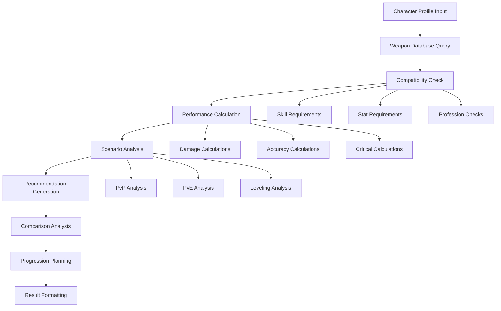

# TinkerFite - Weapon Selection Tool

## Overview

TinkerFite is a weapon identification and selection tool for Anarchy Online that analyzes a character's TinkerProfile to recommend optimal weapon choices. It evaluates weapon compatibility based on character stats, skill levels, profession requirements, and usage scenarios to help players identify the best weapons for their specific character build.

## Core Functionality

### 1. Weapon Compatibility Analysis
- **Requirement Checking**: Verify character meets weapon skill requirements
- **Stat Analysis**: Analyze how character stats affect weapon performance
- **Profession Compatibility**: Check profession-specific weapon restrictions and bonuses
- **Level Appropriateness**: Recommend weapons suitable for character level
- **Skill Progression**: Suggest weapons for future skill milestones

### 2. Weapon Performance Evaluation
- **Effective Damage Calculation**: Calculate real damage output based on character stats
- **Attack Rating Analysis**: Determine hit chance with specific weapons
- **Critical Hit Potential**: Analyze critical hit chance and damage with each weapon
- **Speed vs Damage Optimization**: Compare weapon speed and damage trade-offs
- **Special Attack Effectiveness**: Evaluate special attack success rates

### 3. Weapon Recommendation Engine
- **Best Weapons for Build**: Identify optimal weapons for current character build
- **Alternative Options**: Provide multiple viable weapon choices
- **Upgrade Path Planning**: Suggest weapon progression as character develops
- **Situational Recommendations**: Different weapons for PvP vs PvE scenarios
- **Budget Considerations**: Factor in weapon acquisition costs and availability

### 4. Comparative Analysis
- **Side-by-Side Comparison**: Compare multiple weapons simultaneously
- **Performance Metrics**: Detailed performance breakdowns
- **Stat Impact Visualization**: Show how character stats affect each weapon
- **Scenario Analysis**: Compare performance across different combat situations

## Architecture Design

### Component Structure

```typescript
features/tinker-fite/
├── TinkerFite.vue                      # Main application entry point
├── components/
│   ├── character/
│   │   ├── CharacterAnalyzer.vue       # Analyze character combat capabilities
│   │   ├── StatDisplay.vue             # Display relevant combat stats
│   │   ├── SkillAssessment.vue         # Assess weapon-related skills
│   │   ├── ProfessionBonuses.vue       # Show profession-specific bonuses
│   │   └── LevelProjection.vue         # Project stats at different levels
│   ├── weapons/
│   │   ├── WeaponBrowser.vue           # Browse available weapons
│   │   ├── WeaponCard.vue              # Individual weapon display
│   │   ├── WeaponDetails.vue           # Detailed weapon information
│   │   ├── WeaponFilter.vue            # Filter weapons by criteria
│   │   ├── WeaponSearch.vue            # Search weapon database
│   │   └── WeaponCategories.vue        # Browse by weapon categories
│   ├── analysis/
│   │   ├── CompatibilityChecker.vue    # Check weapon compatibility
│   │   ├── PerformanceCalculator.vue   # Calculate weapon performance
│   │   ├── DamageAnalysis.vue          # Detailed damage calculations
│   │   ├── AccuracyAnalysis.vue        # Hit chance calculations
│   │   ├── CriticalAnalysis.vue        # Critical hit analysis
│   │   └── SpecialAttackAnalysis.vue   # Special attack evaluation
│   ├── recommendations/
│   │   ├── RecommendationEngine.vue    # Main recommendation interface
│   │   ├── TopWeapons.vue              # Display top weapon recommendations
│   │   ├── AlternativeOptions.vue      # Show alternative weapon choices
│   │   ├── UpgradePath.vue             # Display weapon progression path
│   │   ├── SituationalRecommendations.vue # Context-specific recommendations
│   │   └── BudgetOptions.vue           # Cost-effective weapon options
│   ├── comparison/
│   │   ├── WeaponComparison.vue        # Main comparison interface
│   │   ├── ComparisonTable.vue         # Side-by-side weapon comparison
│   │   ├── PerformanceChart.vue        # Visual performance comparison
│   │   ├── StatImpactChart.vue         # Show stat impact on weapons
│   │   └── ScenarioComparison.vue      # Compare across scenarios
│   └── planning/
│       ├── ProgressionPlanner.vue      # Plan weapon progression
│       ├── SkillPlanning.vue           # Plan skill development for weapons
│       ├── AcquisitionPlanner.vue      # Plan weapon acquisition
│       └── BuildIntegration.vue        # Integrate with character builds
├── composables/
│   ├── useWeaponAnalysis.ts            # Weapon analysis logic
│   ├── useCompatibilityCheck.ts        # Compatibility checking logic
│   ├── usePerformanceCalculation.ts    # Performance calculation logic
│   ├── useDamageCalculation.ts         # Damage calculation utilities
│   ├── useAccuracyCalculation.ts       # Hit chance calculation utilities
│   ├── useCriticalCalculation.ts       # Critical hit calculations
│   ├── useWeaponRecommendations.ts     # Recommendation engine logic
│   ├── useWeaponComparison.ts          # Weapon comparison utilities
│   └── useProgressionPlanning.ts       # Progression planning logic
├── services/
│   ├── weaponAnalyzer.ts               # Core weapon analysis engine
│   ├── compatibilityChecker.ts         # Weapon compatibility validation
│   ├── performanceCalculator.ts        # Weapon performance calculations
│   ├── damageCalculator.ts             # Damage calculation engine
│   ├── accuracyCalculator.ts           # Hit chance calculation engine
│   ├── criticalCalculator.ts           # Critical hit calculation engine
│   ├── recommendationEngine.ts         # Weapon recommendation algorithms
│   ├── comparisonEngine.ts             # Weapon comparison algorithms
│   └── progressionPlanner.ts           # Weapon progression planning
├── stores/
│   ├── tinkerFiteStore.ts              # Main application state
│   ├── weaponAnalysisStore.ts          # Weapon analysis state
│   ├── recommendationsStore.ts         # Recommendations state
│   ├── comparisonStore.ts              # Comparison state
│   └── progressionStore.ts             # Progression planning state
├── types/
│   ├── weapon.ts                       # Weapon-related types
│   ├── analysis.ts                     # Analysis-related types
│   ├── compatibility.ts                # Compatibility-related types
│   ├── performance.ts                  # Performance-related types
│   ├── recommendation.ts               # Recommendation-related types
│   └── progression.ts                  # Progression-related types
└── utils/
    ├── weaponCalculations.ts           # Weapon calculation utilities
    ├── compatibilityRules.ts           # Weapon compatibility rules
    ├── performanceMetrics.ts           # Performance metric calculations
    ├── damageFormulas.ts               # Damage calculation formulas
    ├── accuracyFormulas.ts             # Accuracy calculation formulas
    ├── criticalFormulas.ts             # Critical hit formulas
    ├── recommendationAlgorithms.ts     # Recommendation algorithms
    └── progressionRules.ts             # Weapon progression rules
```

## Core Types and Interfaces

### Weapon Analysis
```typescript
interface WeaponAnalysis {
  weapon: Weapon;
  character: TinkerProfile;
  compatibility: CompatibilityResult;
  performance: PerformanceMetrics;
  recommendations: RecommendationLevel;
  projections: LevelProjection[];
}

interface CompatibilityResult {
  canUse: boolean;
  skillRequirements: SkillRequirement[];
  missingSkills: SkillGap[];
  professionCompatibility: ProfessionCompatibility;
  levelRequirements: LevelRequirement[];
  statRequirements: StatRequirement[];
  warnings: CompatibilityWarning[];
}

interface PerformanceMetrics {
  // Damage metrics
  baseDamage: DamageRange;
  effectiveDamage: DamageRange;
  damagePerSecond: number;
  criticalDamage: DamageRange;
  
  // Accuracy metrics
  baseAttackRating: number;
  effectiveAttackRating: number;
  hitChance: number;
  criticalChance: number;
  
  // Speed metrics
  attackSpeed: number;
  initSpeed: number;
  rechargeTime: number;
  
  // Special attack metrics
  specialAttackChance: number;
  specialAttackDamage: DamageRange;
  specialAttackEffectiveness: number;
  
  // Overall performance
  overallRating: number;
  effectivenessScore: number;
  situationalScores: Record<string, number>;
}

interface RecommendationLevel {
  overall: 'excellent' | 'good' | 'fair' | 'poor' | 'incompatible';
  pvp: 'excellent' | 'good' | 'fair' | 'poor' | 'incompatible';
  pve: 'excellent' | 'good' | 'fair' | 'poor' | 'incompatible';
  leveling: 'excellent' | 'good' | 'fair' | 'poor' | 'incompatible';
  endgame: 'excellent' | 'good' | 'fair' | 'poor' | 'incompatible';
}
```

### Weapon Recommendation
```typescript
interface WeaponRecommendation {
  category: WeaponCategory;
  topChoices: WeaponChoice[];
  alternatives: WeaponChoice[];
  upgradePath: WeaponProgression[];
  situationalRecommendations: SituationalRecommendation[];
  budgetOptions: BudgetOption[];
}

interface WeaponChoice {
  weapon: Weapon;
  score: number;
  reasoning: string[];
  performance: PerformanceMetrics;
  pros: string[];
  cons: string[];
  acquisitionInfo: AcquisitionInfo;
}

interface WeaponProgression {
  level: number;
  recommendedWeapons: Weapon[];
  skillMilestones: SkillMilestone[];
  upgradeReasons: string[];
}

interface SituationalRecommendation {
  scenario: 'pvp' | 'pve-solo' | 'pve-team' | 'leveling' | 'endgame';
  weapons: WeaponChoice[];
  explanation: string;
}

interface AcquisitionInfo {
  source: 'shop' | 'mission' | 'drop' | 'craft' | 'quest';
  difficulty: 'easy' | 'medium' | 'hard' | 'very-hard';
  estimatedCost: number;
  availability: 'common' | 'uncommon' | 'rare' | 'very-rare';
  location?: string;
  requirements?: string[];
}
```

### Weapon Comparison
```typescript
interface WeaponComparison {
  weapons: Weapon[];
  character: TinkerProfile;
  comparisonMetrics: ComparisonMetrics;
  scenarios: ScenarioComparison[];
  recommendations: ComparisonRecommendation;
}

interface ComparisonMetrics {
  damage: DamageComparison;
  accuracy: AccuracyComparison;
  speed: SpeedComparison;
  critical: CriticalComparison;
  special: SpecialAttackComparison;
  overall: OverallComparison;
}

interface ScenarioComparison {
  scenario: string;
  rankings: WeaponRanking[];
  bestChoice: Weapon;
  reasoning: string;
}

interface WeaponRanking {
  weapon: Weapon;
  rank: number;
  score: number;
  strengths: string[];
  weaknesses: string[];
}
```

## Analysis Engine Design

### Weapon Analysis Flow


### Core Analysis Service
```typescript
class WeaponAnalyzer {
  private weaponDatabase: WeaponDatabase;
  private compatibilityChecker: CompatibilityChecker;
  private performanceCalculator: PerformanceCalculator;
  private recommendationEngine: RecommendationEngine;
  
  async analyzeWeaponsForCharacter(
    character: TinkerProfile,
    preferences: AnalysisPreferences
  ): Promise<WeaponAnalysisResult> {
    
    // 1. Get relevant weapons from database
    const candidateWeapons = await this.getRelevantWeapons(character, preferences);
    
    // 2. Check compatibility for each weapon
    const compatibilityResults = await Promise.all(
      candidateWeapons.map(weapon => 
        this.compatibilityChecker.checkCompatibility(character, weapon)
      )
    );
    
    // 3. Calculate performance for compatible weapons
    const performanceResults = await Promise.all(
      compatibilityResults
        .filter(result => result.canUse || preferences.includeIncompatible)
        .map(result => 
          this.performanceCalculator.calculatePerformance(character, result.weapon)
        )
    );
    
    // 4. Generate recommendations
    const recommendations = await this.recommendationEngine.generateRecommendations(
      character,
      performanceResults,
      preferences
    );
    
    // 5. Create progression planning
    const progressionPlan = await this.createProgressionPlan(
      character,
      recommendations,
      preferences
    );
    
    return {
      character,
      analyses: performanceResults,
      recommendations,
      progressionPlan,
      timestamp: new Date()
    };
  }
  
  private async getRelevantWeapons(
    character: TinkerProfile,
    preferences: AnalysisPreferences
  ): Promise<Weapon[]> {
    
    const filters: WeaponFilter = {
      // Filter by character level range
      levelRange: {
        min: Math.max(1, character.level - 10),
        max: character.level + 20
      },
      
      // Filter by profession if specified
      professionCompatible: character.profession,
      
      // Filter by weapon categories of interest
      categories: preferences.weaponCategories || 'all',
      
      // Filter by availability
      availability: preferences.availabilityFilter || 'all'
    };
    
    return await this.weaponDatabase.findWeapons(filters);
  }
  
  async compareWeapons(
    character: TinkerProfile,
    weapons: Weapon[],
    scenarios: string[]
  ): Promise<WeaponComparison> {
    
    // Analyze each weapon
    const analyses = await Promise.all(
      weapons.map(weapon => this.analyzeWeapon(character, weapon))
    );
    
    // Compare across scenarios
    const scenarioComparisons = scenarios.map(scenario => 
      this.compareInScenario(analyses, scenario)
    );
    
    // Generate overall comparison
    const overallComparison = this.generateOverallComparison(analyses);
    
    return {
      weapons,
      character,
      analyses,
      scenarioComparisons,
      overallComparison,
      timestamp: new Date()
    };
  }
}
```

## User Interface Design

### Main Interface Layout
- **Character Summary Panel**: Display relevant combat stats and skills
- **Weapon Browser**: Searchable, filterable weapon database
- **Analysis Results**: Compatibility and performance analysis
- **Recommendations Panel**: Top weapon recommendations with reasoning
- **Comparison Tool**: Side-by-side weapon comparison
- **Progression Planner**: Weapon upgrade path visualization

### Key Features
- **Real-time Analysis**: Instant feedback as character stats change
- **Interactive Filtering**: Filter weapons by multiple criteria
- **Visual Performance Metrics**: Charts and graphs for performance data
- **Requirement Highlighting**: Clear indication of met/unmet requirements
- **Scenario Toggle**: Switch between PvP/PvE/Leveling analysis modes
- **Export Options**: Export weapon recommendations and comparisons

## Integration Points

### Character Data Integration
- Import character profiles from TinkerTools character system
- Real-time sync with character stat and skill changes
- Integration with TinkerPlants for equipment-based stat modifications

### Weapon Database Integration
- Live data from items database (weapon subset)
- Advanced search and filtering capabilities
- Weapon requirement and stat information

### Other Tool Integration
- Share weapon recommendations with TinkerNukes for damage analysis
- Integration with TinkerPocket for weapon acquisition planning
- Export builds to TinkerItems for shopping lists

This focused design provides comprehensive weapon identification and selection capabilities while maintaining clear integration with the broader TinkerTools ecosystem.