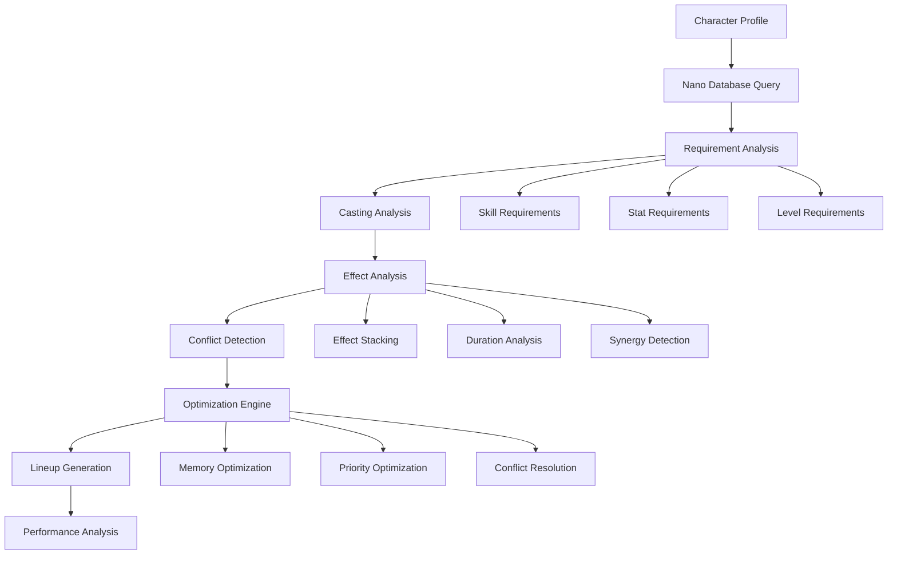

# TinkerNanos - Nano Program Management Tool

## Overview

TinkerNanos is a comprehensive nano program management and optimization tool for Anarchy Online that helps players organize their nano collections, plan nano lineups, optimize casting sequences, and manage nano program effects. It leverages the complex nano data structure to provide intelligent nano management capabilities.

## Core Functionality

### 1. Nano Collection Management
- **Nano Library**: Organize and browse complete nano program collection
- **Nano Categories**: Browse nanos by school, strain, and effect type
- **Search & Filter**: Advanced filtering by casting requirements, effects, and criteria
- **Favorites & Tags**: Personal organization with custom tags and favorites
- **Acquisition Planning**: Track which nanos to obtain and how to get them

### 2. Nano Lineup Planning
- **Active Nano Management**: Plan which nanos to keep uploaded/active
- **Lineup Optimization**: Optimize nano selection for specific scenarios
- **Memory Management**: Manage nano memory limitations and priorities
- **Conflict Resolution**: Handle nano conflicts and mutual exclusions
- **Situation-Specific Lineups**: Different lineups for PvP, PvE, crafting, etc.

### 3. Casting Optimization
- **Requirement Analysis**: Analyze casting requirements vs character capabilities
- **Success Rate Calculation**: Calculate nano casting success rates
- **Resource Management**: Optimize nano point usage and efficiency
- **Casting Sequence Planning**: Plan optimal nano casting sequences
- **Failure Recovery**: Strategies for handling casting failures

### 4. Effect Management & Analysis
- **Effect Tracking**: Track active nano effects and durations
- **Stacking Analysis**: Analyze nano effect stacking and interactions
- **Duration Management**: Optimize effect duration and refresh timing
- **Buff/Debuff Planning**: Plan offensive and defensive nano strategies
- **Effect Synergies**: Identify beneficial nano combinations

## Architecture Design

### Component Structure

```typescript
features/tinker-nanos/
├── TinkerNanos.vue                     # Main application entry point
├── components/
│   ├── collection/
│   │   ├── NanoLibrary.vue             # Main nano collection browser
│   │   ├── NanoCard.vue                # Individual nano program display
│   │   ├── NanoDetails.vue             # Detailed nano information
│   │   ├── NanoSearch.vue              # Advanced nano search
│   │   ├── NanoFilter.vue              # Nano filtering controls
│   │   ├── SchoolBrowser.vue           # Browse nanos by school
│   │   ├── StrainBrowser.vue           # Browse nanos by strain
│   │   └── CollectionStats.vue         # Collection statistics
│   ├── lineup/
│   │   ├── LineupManager.vue           # Main lineup management interface
│   │   ├── ActiveNanos.vue             # Currently active/uploaded nanos
│   │   ├── LineupPlanner.vue           # Plan nano lineups
│   │   ├── MemoryManager.vue           # Manage nano memory usage
│   │   ├── ConflictResolver.vue        # Resolve nano conflicts
│   │   ├── SituationalLineups.vue      # Scenario-specific lineups
│   │   └── LineupComparison.vue        # Compare different lineups
│   ├── casting/
│   │   ├── CastingAnalyzer.vue         # Analyze casting capabilities
│   │   ├── RequirementChecker.vue      # Check casting requirements
│   │   ├── SuccessRateCalculator.vue   # Calculate casting success rates
│   │   ├── CastingSequencer.vue        # Plan casting sequences
│   │   ├── ResourceOptimizer.vue       # Optimize nano point usage
│   │   ├── FailureAnalyzer.vue         # Analyze casting failures
│   │   └── CastingHistory.vue          # Track casting attempts
│   ├── effects/
│   │   ├── EffectTracker.vue           # Track active effects
│   │   ├── EffectAnalyzer.vue          # Analyze nano effects
│   │   ├── StackingAnalyzer.vue        # Analyze effect stacking
│   │   ├── DurationManager.vue         # Manage effect durations
│   │   ├── EffectTimeline.vue          # Timeline of effect changes
│   │   ├── SynergyFinder.vue           # Find nano synergies
│   │   └── EffectComparison.vue        # Compare nano effects
│   ├── planning/
│   │   ├── AcquisitionPlanner.vue      # Plan nano acquisition
│   │   ├── ProgressionPlanner.vue      # Plan nano progression
│   │   ├── SkillPlanning.vue           # Plan skills for nano casting
│   │   ├── LevelPlanning.vue           # Plan nanos by character level
│   │   └── BuildIntegration.vue        # Integrate with character builds
│   └── analysis/
│       ├── NanoAnalytics.vue           # Nano usage analytics
│       ├── PerformanceMetrics.vue      # Nano performance analysis
│       ├── CostBenefitAnalysis.vue     # Analyze nano costs vs benefits
│       ├── EfficiencyAnalyzer.vue      # Analyze nano efficiency
│       └── TrendAnalysis.vue           # Analyze nano usage trends
├── composables/
│   ├── useNanoCollection.ts            # Nano collection management
│   ├── useNanoLineup.ts                # Nano lineup management
│   ├── useNanoCasting.ts               # Nano casting analysis
│   ├── useNanoEffects.ts               # Nano effect management
│   ├── useNanoRequirements.ts          # Nano requirement checking
│   ├── useNanoConflicts.ts             # Nano conflict resolution
│   ├── useNanoOptimization.ts          # Nano optimization logic
│   ├── useNanoPlanning.ts              # Nano planning utilities
│   └── useNanoAnalysis.ts              # Nano analysis utilities
├── services/
│   ├── nanoManager.ts                  # Core nano management service
│   ├── lineupOptimizer.ts              # Nano lineup optimization
│   ├── castingAnalyzer.ts              # Casting analysis engine
│   ├── effectTracker.ts                # Effect tracking service
│   ├── requirementValidator.ts         # Requirement validation
│   ├── conflictResolver.ts             # Conflict resolution service
│   ├── acquisitionPlanner.ts           # Acquisition planning service
│   ├── synergyAnalyzer.ts              # Synergy analysis service
│   └── performanceAnalyzer.ts          # Performance analysis service
├── stores/
│   ├── tinkerNanosStore.ts             # Main application state
│   ├── nanoCollectionStore.ts          # Nano collection state
│   ├── lineupStore.ts                  # Lineup management state
│   ├── castingStore.ts                 # Casting analysis state
│   ├── effectsStore.ts                 # Effects tracking state
│   └── planningStore.ts                # Planning state management
├── types/
│   ├── nano.ts                         # Nano-related types
│   ├── lineup.ts                       # Lineup-related types
│   ├── casting.ts                      # Casting-related types
│   ├── effects.ts                      # Effects-related types
│   ├── requirements.ts                 # Requirements-related types
│   └── planning.ts                     # Planning-related types
└── utils/
    ├── nanoCalculations.ts             # Nano calculation utilities
    ├── castingFormulas.ts              # Casting success formulas
    ├── effectCalculations.ts           # Effect calculation utilities
    ├── requirementChecks.ts            # Requirement checking utilities
    ├── conflictDetection.ts            # Conflict detection utilities
    ├── optimizationAlgorithms.ts       # Optimization algorithms
    └── planningUtilities.ts            # Planning utility functions
```

## Core Types and Interfaces

### Nano Management
```typescript
interface NanoCollection {
  nanos: NanoProgram[];
  categories: NanoCategory[];
  favorites: number[];
  customTags: Record<number, string[]>;
  acquisitionStatus: Record<number, AcquisitionStatus>;
  lastUpdated: Date;
}

interface NanoProgram {
  id: number;
  name: string;
  icon: string;
  school: NanoSchool;
  strain: string;
  description: string;
  
  // Casting requirements
  castingRequirements: CastingRequirement[];
  nanoPointCost: number;
  castingTime: number;
  rechargeTime: number;
  
  // Effects
  effects: NanoEffect[];
  duration: EffectDuration;
  targeting: TargetingData;
  
  // Meta information
  level: number;
  profession?: string;
  sourceLocation?: string;
  acquisitionMethod?: string;
}

interface CastingRequirement {
  type: 'skill' | 'stat' | 'nano' | 'item';
  requirement: number | string;
  value: number;
  critical: boolean; // Must be met vs recommended
}

interface NanoEffect {
  type: EffectType;
  statId?: number;
  value: number;
  modifier: EffectModifier;
  conditions: EffectCondition[];
  stackable: boolean;
  conflicts: number[]; // Conflicting nano IDs
}

enum NanoSchool {
  MATTER_METAMORPHOSIS = 'Matter Metamorphosis',
  BIOLOGICAL_METAMORPHOSIS = 'Biological Metamorphosis',
  PSYCHOLOGICAL_MODIFICATIONS = 'Psychological Modifications',
  MATTER_CREATION = 'Matter Creation',
  TIME_AND_SPACE = 'Time and Space',
  SENSORY_IMPROVEMENT = 'Sensory Improvement'
}

enum EffectType {
  STAT_BOOST = 'stat_boost',
  HEAL = 'heal',
  DAMAGE = 'damage',
  PROTECTION = 'protection',
  TELEPORT = 'teleport',
  SUMMON = 'summon',
  DEBUFF = 'debuff',
  UTILITY = 'utility'
}
```

### Nano Lineup Management
```typescript
interface NanoLineup {
  id: string;
  name: string;
  description: string;
  scenario: LineupScenario;
  
  // Active nanos
  uploadedNanos: number[];
  memoryUsage: MemoryUsage;
  
  // Lineup optimization
  priorities: NanoPriority[];
  constraints: LineupConstraints;
  
  // Performance metrics
  effectiveness: EffectivenessMetrics;
  conflicts: NanoConflict[];
  
  // Metadata
  created: Date;
  lastModified: Date;
  useCount: number;
}

interface MemoryUsage {
  totalMemory: number;
  usedMemory: number;
  availableMemory: number;
  memoryPerNano: Record<number, number>;
  optimizationPotential: number;
}

interface NanoPriority {
  nanoId: number;
  priority: number; // 1-10
  reason: string;
  scenario?: string;
}

interface LineupConstraints {
  maxMemoryUsage: number;
  requiredNanos: number[];
  excludedNanos: number[];
  schoolLimitations: Record<NanoSchool, number>;
  conflictResolution: ConflictResolutionStrategy;
}

enum LineupScenario {
  PVP = 'pvp',
  PVE_SOLO = 'pve_solo',
  PVE_TEAM = 'pve_team',
  CRAFTING = 'crafting',
  LEVELING = 'leveling',
  SOCIAL = 'social',
  GENERAL = 'general'
}

enum ConflictResolutionStrategy {
  PRIORITIZE_HIGHER = 'prioritize_higher',
  PRIORITIZE_DURATION = 'prioritize_duration',
  PRIORITIZE_EFFICIENCY = 'prioritize_efficiency',
  MANUAL_SELECTION = 'manual_selection'
}
```

### Casting Analysis
```typescript
interface CastingAnalysis {
  nanoId: number;
  character: TinkerProfile;
  analysis: CastingResult;
  recommendations: CastingRecommendation[];
  alternatives: AlternativeNano[];
}

interface CastingResult {
  canCast: boolean;
  successRate: number;
  requirements: RequirementCheck[];
  resourceCosts: ResourceCost;
  limitations: CastingLimitation[];
  optimizations: CastingOptimization[];
}

interface RequirementCheck {
  requirement: CastingRequirement;
  met: boolean;
  currentValue: number;
  shortfall: number;
  timeToMeet?: number;
}

interface ResourceCost {
  nanoPoints: number;
  nanoPointsPercentage: number;
  castingTime: number;
  rechargeTime: number;
  opportunity: OpportunityCost;
}

interface CastingSequence {
  sequence: CastingStep[];
  totalTime: number;
  totalNanoPoints: number;
  successProbability: number;
  alternatives: AlternativeSequence[];
}

interface CastingStep {
  nanoId: number;
  order: number;
  timing: number;
  prerequisites: number[];
  conflicts: number[];
  reason: string;
}
```

### Effect Management
```typescript
interface EffectState {
  activeEffects: ActiveEffect[];
  expiringEffects: ExpiringEffect[];
  plannedEffects: PlannedEffect[];
  effectHistory: EffectHistory[];
  interactions: EffectInteraction[];
}

interface ActiveEffect {
  nanoId: number;
  effect: NanoEffect;
  startTime: Date;
  endTime: Date;
  remainingTime: number;
  strength: number;
  source: EffectSource;
  refreshable: boolean;
}

interface EffectInteraction {
  effect1: number;
  effect2: number;
  interactionType: InteractionType;
  result: InteractionResult;
  recommendation: string;
}

enum InteractionType {
  STACKING = 'stacking',
  CONFLICT = 'conflict',
  SYNERGY = 'synergy',
  OVERRIDE = 'override',
  ENHANCEMENT = 'enhancement'
}

interface EffectSynergy {
  nanos: number[];
  synergyType: SynergyType;
  benefit: SynergyBenefit;
  requirements: SynergyRequirement[];
  effectiveness: number;
}

enum SynergyType {
  MULTIPLICATIVE = 'multiplicative',
  ADDITIVE = 'additive',
  CONDITIONAL = 'conditional',
  SEQUENTIAL = 'sequential',
  COMPLEMENTARY = 'complementary'
}
```

## Nano Management Engine Design

### Nano Analysis Flow


### Core Management Service
```typescript
class NanoManager {
  private nanoDatabase: NanoDatabase;
  private castingAnalyzer: CastingAnalyzer;
  private effectTracker: EffectTracker;
  private lineupOptimizer: LineupOptimizer;
  private conflictResolver: ConflictResolver;
  
  async analyzeNanoCapabilities(
    character: TinkerProfile,
    preferences: AnalysisPreferences
  ): Promise<NanoAnalysisResult> {
    
    // 1. Get relevant nanos from database
    const availableNanos = await this.getAvailableNanos(character, preferences);
    
    // 2. Analyze casting capabilities for each nano
    const castingAnalyses = await Promise.all(
      availableNanos.map(nano => 
        this.castingAnalyzer.analyzeCasting(character, nano)
      )
    );
    
    // 3. Analyze effects and interactions
    const effectAnalyses = await this.analyzeEffects(
      castingAnalyses.filter(analysis => analysis.canCast),
      character
    );
    
    // 4. Detect conflicts and synergies
    const interactions = await this.analyzeInteractions(effectAnalyses);
    
    // 5. Generate optimized lineups
    const recommendedLineups = await this.generateLineups(
      effectAnalyses,
      interactions,
      preferences
    );
    
    return {
      character,
      availableNanos: castingAnalyses,
      effects: effectAnalyses,
      interactions,
      recommendedLineups,
      timestamp: new Date()
    };
  }
  
  async optimizeLineup(
    character: TinkerProfile,
    scenario: LineupScenario,
    constraints: LineupConstraints
  ): Promise<OptimizedLineup> {
    
    // 1. Get castable nanos for character
    const castableNanos = await this.getCastableNanos(character);
    
    // 2. Apply scenario-specific filtering
    const scenarioNanos = this.filterForScenario(castableNanos, scenario);
    
    // 3. Optimize nano selection within memory constraints
    const optimizedSelection = await this.lineupOptimizer.optimize({
      nanos: scenarioNanos,
      memoryLimit: constraints.maxMemoryUsage,
      priorities: constraints.priorities,
      requiredNanos: constraints.requiredNanos,
      excludedNanos: constraints.excludedNanos
    });
    
    // 4. Resolve any conflicts
    const resolvedLineup = await this.conflictResolver.resolve(
      optimizedSelection,
      constraints.conflictResolution
    );
    
    // 5. Calculate performance metrics
    const performance = await this.calculateLineupPerformance(
      resolvedLineup,
      character,
      scenario
    );
    
    return {
      lineup: resolvedLineup,
      performance,
      alternatives: await this.generateAlternatives(resolvedLineup, constraints),
      warnings: this.validateLineup(resolvedLineup, character)
    };
  }
  
  async trackEffects(
    character: TinkerProfile,
    activeNanos: number[]
  ): Promise<EffectState> {
    
    // 1. Get current active effects
    const activeEffects = await this.effectTracker.getActiveEffects(
      character,
      activeNanos
    );
    
    // 2. Calculate effect interactions
    const interactions = await this.calculateInteractions(activeEffects);
    
    // 3. Predict effect timeline
    const timeline = await this.predictEffectTimeline(
      activeEffects,
      interactions
    );
    
    // 4. Identify optimization opportunities
    const optimizations = await this.identifyOptimizations(
      activeEffects,
      timeline,
      character
    );
    
    return {
      activeEffects,
      interactions,
      timeline,
      optimizations,
      recommendations: await this.generateEffectRecommendations(
        activeEffects,
        optimizations
      )
    };
  }
}
```

## User Interface Design

### Main Interface Layout
- **Nano Collection Panel**: Browsable nano library with search and filters
- **Active Lineup Panel**: Currently uploaded nanos with memory usage
- **Analysis Dashboard**: Casting success rates and effect analysis
- **Lineup Planner**: Scenario-based lineup optimization
- **Effect Tracker**: Real-time effect monitoring and timeline
- **Planning Tools**: Acquisition and progression planning

### Key Features
- **Real-time Requirements**: Live updating of casting requirements vs character
- **Visual Memory Management**: Graphical memory usage and optimization
- **Interactive Effect Timeline**: Timeline showing effect duration and interactions
- **Conflict Highlighting**: Visual indication of nano conflicts and resolutions
- **Drag-and-Drop Lineup**: Intuitive lineup creation with drag-and-drop
- **Scenario Switching**: Quick switching between different lineup scenarios

## Integration Points

### Character Data Integration
- Real-time sync with character skill and stat changes
- Integration with TinkerPlants for stat modifications from implants/symbiants
- Character progression tracking for nano planning

### Nano Database Integration
- Live data from nanos database with full casting and effect information
- Advanced search and filtering capabilities
- Nano requirement and effect tracking

### Other Tool Integration
- Share optimized lineups with TinkerFite for combat preparation
- Integration with TinkerPocket for nano acquisition planning
- Export nano lists to TinkerItems for shopping and acquisition

This comprehensive design provides sophisticated nano program management capabilities while maintaining seamless integration with the broader TinkerTools ecosystem.