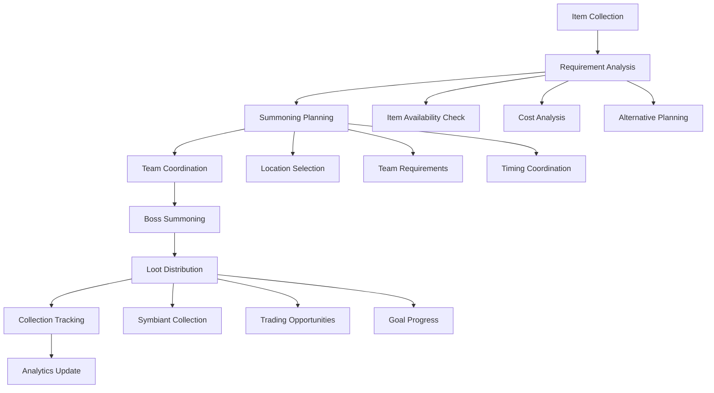

# TinkerPocket - Pocket Boss & Item Collection Tool

## Overview

TinkerPocket is a specialized tool for managing pocket boss summoning and item collection in Anarchy Online. It helps players organize pocket boss items, plan summoning strategies, coordinate pocket boss fights, and track symbiant collection from pocket bosses that are spawned on-demand using collected items rather than on timers.

## Core Functionality

### 1. Pocket Boss Item Management
- **Item Collection Tracking**: Track collection of pocket boss summoning items
- **Summoning Requirements**: Manage requirements for spawning specific pocket bosses
- **Item Sources**: Track where to obtain pocket boss summoning items
- **Collection Progress**: Monitor progress toward specific pocket boss goals
- **Item Value Analysis**: Analyze the value and efficiency of pocket boss items

### 2. Pocket Boss Coordination
- **Boss Database**: Comprehensive database of pocket bosses and their rewards
- **Summoning Planning**: Plan which pocket bosses to summon and when
- **Team Coordination**: Coordinate pocket boss fights with team members
- **Location Management**: Track optimal locations for pocket boss fights
- **Fight Preparation**: Prepare for pocket boss encounters

### 3. Symbiant Collection Planning
- **Loot Tables**: Detailed symbiant drop information from pocket bosses
- **Collection Goals**: Set and track symbiant collection objectives
- **Drop Rate Analysis**: Analyze symbiant drop rates from pocket bosses
- **Alternative Sources**: Compare pocket boss drops with regular boss drops
- **Collection Optimization**: Optimize symbiant acquisition strategies

### 4. Resource Management & Trading
- **Item Inventory**: Track current inventory of pocket boss items
- **Trading Coordination**: Coordinate trading of pocket boss items
- **Cost Analysis**: Analyze costs vs benefits of pocket boss summoning
- **Resource Planning**: Plan resource allocation for pocket boss activities
- **Market Analysis**: Track market values and trading opportunities

## Architecture Design

### Component Structure

```typescript
features/tinker-pocket/
├── TinkerPocket.vue                    # Main application entry point
├── components/
│   ├── items/
│   │   ├── ItemCollection.vue          # Main item collection interface
│   │   ├── ItemTracker.vue             # Track pocket boss items
│   │   ├── ItemSources.vue             # Item source information
│   │   ├── CollectionProgress.vue      # Progress toward summoning goals
│   │   ├── ItemValue.vue               # Item value analysis
│   │   ├── InventoryManager.vue        # Manage current inventory
│   │   └── AcquisitionPlanner.vue      # Plan item acquisition
│   ├── bosses/
│   │   ├── PocketBossDatabase.vue      # Database of pocket bosses
│   │   ├── BossCard.vue                # Individual pocket boss display
│   │   ├── BossDetails.vue             # Detailed boss information
│   │   ├── SummoningPlanner.vue        # Plan boss summoning
│   │   ├── BossSearch.vue              # Search and filter bosses
│   │   ├── FightPreparation.vue        # Prepare for boss fights
│   │   └── EncounterHistory.vue        # Track boss fight history
│   ├── summoning/
│   │   ├── SummoningInterface.vue      # Main summoning interface
│   │   ├── RequirementChecker.vue      # Check summoning requirements
│   │   ├── LocationSelector.vue        # Select summoning locations
│   │   ├── TeamCoordinator.vue         # Coordinate with team
│   │   ├── SummoningQueue.vue          # Queue planned summons
│   │   ├── ResourceCalculator.vue      # Calculate resource needs
│   │   └── SummoningHistory.vue        # Track summoning history
│   ├── symbiants/
│   │   ├── SymbiantLootTable.vue       # Pocket boss symbiant drops
│   │   ├── CollectionTracker.vue       # Track symbiant collection
│   │   ├── DropAnalysis.vue            # Analyze drop rates
│   │   ├── CollectionGoals.vue         # Set collection objectives
│   │   ├── AlternativeAnalysis.vue     # Compare with regular bosses
│   │   └── CollectionOptimizer.vue     # Optimize collection strategy
│   ├── trading/
│   │   ├── TradingInterface.vue        # Item trading interface
│   │   ├── MarketAnalysis.vue          # Market value analysis
│   │   ├── TradingOpportunities.vue    # Trading opportunities
│   │   ├── NegotiationTools.vue        # Trading negotiation tools
│   │   ├── TradingHistory.vue          # Track trading history
│   │   └── ContactManager.vue          # Manage trading contacts
│   ├── planning/
│   │   ├── ResourcePlanner.vue         # Plan resource allocation
│   │   ├── CostBenefitAnalysis.vue     # Analyze costs vs benefits
│   │   ├── EfficiencyAnalyzer.vue      # Analyze summoning efficiency
│   │   ├── GoalPlanner.vue             # Plan collection goals
│   │   └── ProgressTracker.vue         # Track overall progress
│   └── analytics/
│       ├── CollectionAnalytics.vue     # Collection statistics
│       ├── SummoningAnalytics.vue      # Summoning performance
│       ├── TradingAnalytics.vue        # Trading performance
│       ├── EfficiencyMetrics.vue       # Efficiency measurements
│       └── TrendAnalysis.vue           # Market and collection trends
├── composables/
│   ├── useItemCollection.ts            # Item collection management
│   ├── usePocketBosses.ts              # Pocket boss management
│   ├── useSummoning.ts                 # Summoning logic
│   ├── useSymbiantTracking.ts          # Symbiant collection tracking
│   ├── useTrading.ts                   # Trading coordination
│   ├── useResourcePlanning.ts          # Resource planning logic
│   ├── useMarketAnalysis.ts            # Market analysis utilities
│   └── useAnalytics.ts                 # Analytics and statistics
├── services/
│   ├── itemTracker.ts                  # Item collection tracking service
│   ├── pocketBossManager.ts            # Pocket boss management service
│   ├── summoningPlanner.ts             # Summoning planning service
│   ├── lootAnalyzer.ts                 # Loot analysis service
│   ├── tradingService.ts               # Trading coordination service
│   ├── marketAnalyzer.ts               # Market analysis service
│   ├── resourceOptimizer.ts            # Resource optimization service
│   └── analyticsEngine.ts              # Analytics and reporting engine
├── stores/
│   ├── tinkerPocketStore.ts            # Main application state
│   ├── itemCollectionStore.ts          # Item collection state
│   ├── pocketBossStore.ts              # Pocket boss state
│   ├── summoningStore.ts               # Summoning planning state
│   ├── symbiantCollectionStore.ts      # Symbiant collection state
│   ├── tradingStore.ts                 # Trading state
│   └── analyticsStore.ts               # Analytics state
├── types/
│   ├── pocket-boss.ts                  # Pocket boss types
│   ├── summoning.ts                    # Summoning types
│   ├── item-collection.ts              # Item collection types
│   ├── symbiant-collection.ts          # Symbiant collection types
│   ├── trading.ts                      # Trading types
│   └── analytics.ts                    # Analytics types
└── utils/
    ├── summoningCalculations.ts        # Summoning requirement calculations
    ├── lootCalculations.ts             # Loot probability calculations
    ├── marketCalculations.ts           # Market value calculations
    ├── efficiencyCalculations.ts       # Efficiency analysis calculations
    ├── tradingUtilities.ts             # Trading utilities
    └── collectionUtilities.ts          # Collection management utilities
```

## Core Types and Interfaces

### Pocket Boss Management
```typescript
interface PocketBoss {
  id: string;
  name: string;
  level: number;
  type: PocketBossType;
  summoningRequirements: SummoningRequirement[];
  lootTable: PocketBossLootTable;
  difficulty: DifficultyRating;
  recommendedTeamSize: number;
  location: LocationRequirement[];
  notes?: string;
}

interface SummoningRequirement {
  itemType: 'pocket_boss_item' | 'material' | 'credits';
  itemId?: number;
  itemName: string;
  quantity: number;
  optional: boolean;
  alternatives: AlternativeRequirement[];
}

interface PocketBossItem {
  id: number;
  name: string;
  type: PocketBossItemType;
  spawnsFor: PocketBoss[];
  sources: ItemSource[];
  marketValue: MarketValue;
  rarity: ItemRarity;
  description: string;
}

interface ItemSource {
  type: 'drop' | 'mission' | 'shop' | 'quest' | 'craft';
  source: string;
  location?: string;
  dropRate?: number;
  requirements?: string[];
  difficulty: DifficultyRating;
}

enum PocketBossType {
  SYMBIANT = 'symbiant',
  RARE = 'rare',
  UNIQUE = 'unique',
  SPECIAL = 'special',
  EVENT = 'event'
}

enum PocketBossItemType {
  PATTERN = 'pattern',
  ESSENCE = 'essence',
  COMPONENT = 'component',
  KEY = 'key',
  CATALYST = 'catalyst'
}

enum ItemRarity {
  COMMON = 'common',
  UNCOMMON = 'uncommon',
  RARE = 'rare',
  VERY_RARE = 'very_rare',
  LEGENDARY = 'legendary'
}
```

### Collection Management
```typescript
interface ItemCollection {
  items: CollectedItem[];
  goals: CollectionGoal[];
  progress: CollectionProgress;
  statistics: CollectionStatistics;
  lastUpdated: Date;
}

interface CollectedItem {
  item: PocketBossItem;
  quantity: number;
  acquired: AcquisitionRecord[];
  reserved: ReservationInfo[];
  tradeable: boolean;
  estimatedValue: number;
}

interface CollectionGoal {
  id: string;
  name: string;
  description: string;
  targetBosses: PocketBoss[];
  targetSymbiants: Symbiant[];
  priority: number;
  deadline?: Date;
  progress: GoalProgress;
  status: GoalStatus;
}

interface SummoningPlan {
  id: string;
  name: string;
  boss: PocketBoss;
  scheduledTime?: Date;
  team: TeamMember[];
  location: SummoningLocation;
  requirements: RequirementStatus[];
  preparation: PreparationChecklist;
  status: PlanStatus;
}

interface RequirementStatus {
  requirement: SummoningRequirement;
  fulfilled: boolean;
  available: number;
  needed: number;
  source?: ItemSource;
  estimatedCost?: number;
}

interface PreparationChecklist {
  items: ChecklistItem[];
  team: ChecklistItem[];
  location: ChecklistItem[];
  strategy: ChecklistItem[];
  completed: boolean;
}

enum GoalStatus {
  PLANNING = 'planning',
  IN_PROGRESS = 'in_progress',
  WAITING_FOR_RESOURCES = 'waiting_for_resources',
  READY_TO_SUMMON = 'ready_to_summon',
  COMPLETED = 'completed',
  CANCELLED = 'cancelled'
}

enum PlanStatus {
  DRAFT = 'draft',
  SCHEDULED = 'scheduled',
  PREPARING = 'preparing',
  READY = 'ready',
  IN_PROGRESS = 'in_progress',
  COMPLETED = 'completed',
  CANCELLED = 'cancelled'
}
```

### Trading Management
```typescript
interface TradingOpportunity {
  id: string;
  type: 'buying' | 'selling' | 'exchange';
  item: PocketBossItem;
  quantity: number;
  priceRange: PriceRange;
  trader: TradingContact;
  conditions: TradingCondition[];
  expiry?: Date;
  status: TradingStatus;
  notes?: string;
}

interface TradingContact {
  name: string;
  reputation: ReputationRating;
  preferredItems: PocketBossItem[];
  contactMethods: ContactMethod[];
  tradingHistory: TradingHistory[];
  reliability: ReliabilityRating;
}

interface MarketAnalysis {
  item: PocketBossItem;
  currentPrice: PriceRange;
  priceHistory: PriceHistoryPoint[];
  demandLevel: DemandLevel;
  supplyLevel: SupplyLevel;
  priceProjection: PriceProjection;
  tradingRecommendation: TradingRecommendation;
}

interface EfficiencyAnalysis {
  boss: PocketBoss;
  costAnalysis: CostAnalysis;
  rewardAnalysis: RewardAnalysis;
  timeInvestment: TimeInvestment;
  riskAssessment: RiskAssessment;
  efficiency: EfficiencyScore;
  recommendations: EfficiencyRecommendation[];
}

enum TradingStatus {
  AVAILABLE = 'available',
  NEGOTIATING = 'negotiating',
  AGREED = 'agreed',
  PENDING_DELIVERY = 'pending_delivery',
  COMPLETED = 'completed',
  CANCELLED = 'cancelled',
  EXPIRED = 'expired'
}

enum DemandLevel {
  VERY_LOW = 'very_low',
  LOW = 'low',
  MODERATE = 'moderate',
  HIGH = 'high',
  VERY_HIGH = 'very_high'
}
```

## Pocket Boss Management Engine Design

### Management Flow


### Core Management Service
```typescript
class PocketBossManager {
  private itemTracker: ItemTracker;
  private summoningPlanner: SummoningPlanner;
  private lootAnalyzer: LootAnalyzer;
  private tradingService: TradingService;
  private marketAnalyzer: MarketAnalyzer;
  
  async planSummoning(
    targetBoss: PocketBoss,
    goals: CollectionGoal[],
    constraints: SummoningConstraints
  ): Promise<SummoningPlan> {
    
    // 1. Check current item availability
    const availability = await this.itemTracker.checkAvailability(
      targetBoss.summoningRequirements
    );
    
    // 2. Identify missing requirements
    const missingItems = availability.filter(req => !req.fulfilled);
    
    // 3. Plan acquisition for missing items
    const acquisitionPlan = await this.planItemAcquisition(
      missingItems,
      constraints
    );
    
    // 4. Estimate costs and time
    const estimates = await this.calculateEstimates(
      targetBoss,
      acquisitionPlan
    );
    
    // 5. Generate summoning plan
    const plan: SummoningPlan = {
      id: generateId(),
      name: `Summon ${targetBoss.name}`,
      boss: targetBoss,
      scheduledTime: this.calculateOptimalTime(estimates, constraints),
      team: await this.assembleTeam(targetBoss, constraints),
      location: await this.selectLocation(targetBoss, constraints),
      requirements: availability,
      preparation: await this.generatePreparationChecklist(
        targetBoss,
        acquisitionPlan
      ),
      status: missingItems.length > 0 ? 'preparing' : 'ready'
    };
    
    return plan;
  }
  
  async optimizeCollection(
    goals: CollectionGoal[],
    resources: AvailableResources
  ): Promise<CollectionStrategy> {
    
    // 1. Analyze goal requirements
    const requirements = await this.analyzeGoalRequirements(goals);
    
    // 2. Identify optimal pocket bosses for goals
    const optimalBosses = await this.identifyOptimalBosses(
      requirements,
      resources
    );
    
    // 3. Plan summoning order
    const summoningOrder = await this.optimizeSummoningOrder(
      optimalBosses,
      resources
    );
    
    // 4. Calculate efficiency metrics
    const efficiency = await this.calculateCollectionEfficiency(
      summoningOrder,
      goals,
      resources
    );
    
    // 5. Generate alternative strategies
    const alternatives = await this.generateAlternativeStrategies(
      goals,
      resources,
      efficiency
    );
    
    return {
      goals,
      recommendedBosses: optimalBosses,
      summoningOrder,
      efficiency,
      alternatives,
      estimatedCompletion: this.estimateCompletionTime(summoningOrder),
      resourceRequirements: this.calculateResourceRequirements(summoningOrder)
    };
  }
  
  async analyzeMarketOpportunities(
    targetItems: PocketBossItem[],
    budget: number
  ): Promise<MarketAnalysis[]> {
    
    // 1. Get current market data
    const marketData = await this.marketAnalyzer.getCurrentMarketData(
      targetItems
    );
    
    // 2. Analyze price trends
    const trends = await Promise.all(
      targetItems.map(item => 
        this.marketAnalyzer.analyzePriceTrends(item)
      )
    );
    
    // 3. Identify trading opportunities
    const opportunities = await this.tradingService.findOpportunities(
      targetItems,
      budget
    );
    
    // 4. Generate recommendations
    const recommendations = await this.generateTradingRecommendations(
      marketData,
      trends,
      opportunities,
      budget
    );
    
    return targetItems.map((item, index) => ({
      item,
      currentPrice: marketData[index].currentPrice,
      priceHistory: trends[index].history,
      demandLevel: trends[index].demand,
      supplyLevel: trends[index].supply,
      priceProjection: trends[index].projection,
      tradingRecommendation: recommendations[index]
    }));
  }
  
  async trackCollectionProgress(
    goals: CollectionGoal[]
  ): Promise<CollectionProgress> {
    
    // 1. Calculate current progress for each goal
    const goalProgress = await Promise.all(
      goals.map(goal => this.calculateGoalProgress(goal))
    );
    
    // 2. Identify blockers and bottlenecks
    const blockers = await this.identifyBlockers(goals, goalProgress);
    
    // 3. Generate next action recommendations
    const nextActions = await this.generateNextActions(
      goals,
      goalProgress,
      blockers
    );
    
    // 4. Calculate overall collection metrics
    const metrics = await this.calculateCollectionMetrics(
      goals,
      goalProgress
    );
    
    return {
      goals: goalProgress,
      blockers,
      nextActions,
      metrics,
      completionEstimate: this.estimateOverallCompletion(goalProgress),
      lastUpdated: new Date()
    };
  }
}
```

## User Interface Design

### Main Interface Layout
- **Collection Dashboard**: Overview of current item collection and goals
- **Pocket Boss Browser**: Database of pocket bosses with summoning requirements
- **Summoning Planner**: Plan and coordinate pocket boss summons
- **Trading Center**: Market analysis and trading coordination
- **Progress Tracker**: Track collection goals and achievements
- **Analytics Panel**: Performance metrics and efficiency analysis

### Key Features
- **Requirement Checker**: Real-time checking of summoning requirements
- **Resource Calculator**: Calculate costs and resources needed
- **Team Coordination**: Coordinate summoning with team members
- **Market Integration**: Live market data and trading opportunities
- **Goal Tracking**: Visual progress tracking for collection goals
- **Efficiency Optimizer**: Optimize summoning strategies for maximum efficiency

## Integration Points

### Character Data Integration
- Import character level and capabilities for pocket boss difficulty assessment
- Integration with TinkerPlants for symbiant planning needs
- Character resource tracking for summoning costs

### Item Database Integration
- Live data from items database for pocket boss summoning items
- Integration with market data for trading opportunities
- Symbiant data integration for collection planning

### Other Tool Integration
- Share symbiant collection goals with TinkerPlants for planning
- Integration with TinkerNukes for pocket boss combat analysis
- Export collection data to TinkerItems for inventory management

This refocused design provides comprehensive pocket boss management capabilities centered around on-demand summoning mechanics rather than spawn timers, while maintaining seamless integration with the broader TinkerTools ecosystem.