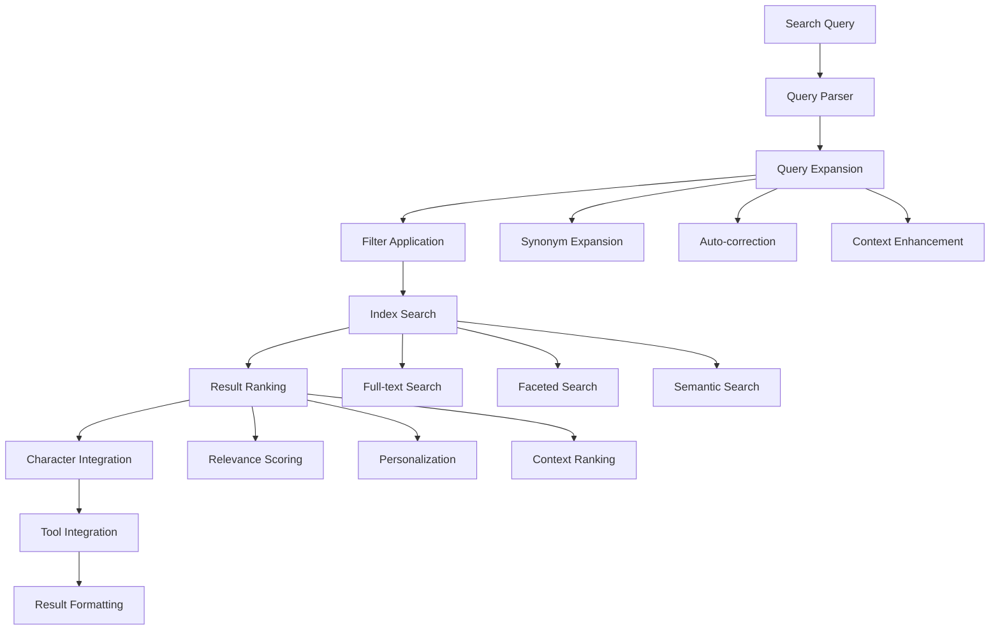

# TinkerItems - Comprehensive Item Database Interface

## Overview

TinkerItems is the central item database interface for TinkerTools, providing comprehensive search, browsing, and analysis capabilities for all items, weapons, nano programs, and symbiants in Anarchy Online. It serves as the unified data access layer for all other TinkerTools applications while offering powerful standalone functionality for item research and discovery.

## Core Functionality

### 1. Universal Item Search & Discovery
- **Advanced Search Engine**: Multi-criteria search across all item types
- **Intelligent Filtering**: Dynamic filtering by stats, requirements, effects, and properties
- **Search Suggestions**: Auto-complete and search suggestions based on user intent
- **Semantic Search**: Natural language queries for item discovery
- **Search History**: Track and revisit previous searches

### 2. Comprehensive Item Browsing
- **Category Navigation**: Browse by item types, weapon categories, nano schools, etc.
- **Hierarchical Organization**: Drill-down browsing from general to specific
- **Related Items**: Discover related and similar items
- **Item Collections**: Curated collections and themed item sets
- **Random Discovery**: Explore random items for discovery

### 3. Detailed Item Analysis
- **Complete Item Information**: Full item details with all available data
- **Stat Analysis**: Detailed breakdown of item statistics and modifiers
- **Requirement Analysis**: Complete requirement information and character compatibility
- **Effect Analysis**: Detailed analysis of item effects and interactions
- **Historical Data**: Item changes and evolution over time

### 4. Cross-Tool Integration Hub
- **Character Integration**: How items work with current character builds
- **Tool Recommendations**: Suggest items for other TinkerTools applications
- **Comparison Tools**: Compare items across multiple criteria
- **Shopping Lists**: Create and manage item acquisition lists
- **Build Integration**: Integration with all other TinkerTools for item selection

## Architecture Design

### Component Structure

```typescript
features/tinker-items/
├── TinkerItems.vue                     # Main application entry point
├── components/
│   ├── search/
│   │   ├── UniversalSearch.vue         # Main search interface
│   │   ├── AdvancedSearch.vue          # Advanced search with multiple criteria
│   │   ├── SearchFilters.vue           # Dynamic filtering components
│   │   ├── SearchSuggestions.vue       # Search suggestions and auto-complete
│   │   ├── SearchHistory.vue           # Search history management
│   │   ├── SemanticSearch.vue          # Natural language search interface
│   │   └── QuickSearch.vue             # Quick search widget
│   ├── browsing/
│   │   ├── CategoryBrowser.vue         # Browse by categories
│   │   ├── ItemGrid.vue                # Grid display of items
│   │   ├── ItemList.vue                # List display of items
│   │   ├── HierarchicalBrowser.vue     # Tree-style browsing
│   │   ├── CollectionBrowser.vue       # Browse curated collections
│   │   ├── RelatedItems.vue            # Show related items
│   │   └── RandomExplorer.vue          # Random item discovery
│   ├── display/
│   │   ├── ItemCard.vue                # Standard item display card
│   │   ├── ItemDetails.vue             # Detailed item information
│   │   ├── ItemTooltip.vue             # Hover tooltip for items
│   │   ├── ItemComparison.vue          # Side-by-side item comparison
│   │   ├── ItemVisualization.vue       # Visual item representation
│   │   ├── ItemHistory.vue             # Item change history
│   │   └── ItemStats.vue               # Statistical breakdowns
│   ├── analysis/
│   │   ├── StatAnalyzer.vue            # Analyze item statistics
│   │   ├── RequirementAnalyzer.vue     # Analyze item requirements
│   │   ├── EffectAnalyzer.vue          # Analyze item effects
│   │   ├── CompatibilityChecker.vue    # Check character compatibility
│   │   ├── ValueAnalyzer.vue           # Analyze item values
│   │   ├── TrendAnalyzer.vue           # Analyze item trends
│   │   └── PerformanceAnalyzer.vue     # Analyze item performance
│   ├── collections/
│   │   ├── CollectionManager.vue       # Manage item collections
│   │   ├── WishlistManager.vue         # Manage item wishlists
│   │   ├── ShoppingListManager.vue     # Manage shopping lists
│   │   ├── FavoritesList.vue           # Manage favorite items
│   │   ├── CollectionSharing.vue       # Share collections
│   │   └── CollectionAnalytics.vue     # Collection statistics
│   ├── integration/
│   │   ├── CharacterIntegration.vue    # Character compatibility integration
│   │   ├── PlantsIntegration.vue       # TinkerPlants integration
│   │   ├── FiteIntegration.vue         # TinkerFite integration
│   │   ├── NanosIntegration.vue        # TinkerNanos integration
│   │   ├── NukesIntegration.vue        # TinkerNukes integration
│   │   ├── PocketIntegration.vue       # TinkerPocket integration
│   │   └── CrossToolRecommendations.vue # Cross-tool recommendations
│   ├── tools/
│   │   ├── ItemComparator.vue          # Advanced item comparison tool
│   │   ├── RequirementCalculator.vue   # Calculate requirements
│   │   ├── StatCalculator.vue          # Calculate stat impacts
│   │   ├── EffectCalculator.vue        # Calculate effect impacts
│   │   ├── ValueCalculator.vue         # Calculate item values
│   │   └── BuildAnalyzer.vue           # Analyze complete builds
│   └── data/
│       ├── ItemDatabase.vue            # Database management interface
│       ├── DataExplorer.vue            # Explore raw item data
│       ├── DataVisualization.vue       # Visualize item data
│       ├── DataExport.vue              # Export item data
│       ├── DataImport.vue              # Import item data
│       └── DataValidation.vue          # Validate item data
├── composables/
│   ├── useItemSearch.ts                # Item search functionality
│   ├── useItemFiltering.ts             # Item filtering logic
│   ├── useItemComparison.ts            # Item comparison utilities
│   ├── useItemAnalysis.ts              # Item analysis utilities
│   ├── useItemCollections.ts           # Collection management
│   ├── useCharacterIntegration.ts      # Character integration logic
│   ├── useCrossToolIntegration.ts      # Cross-tool integration
│   ├── useItemRecommendations.ts       # Item recommendation engine
│   └── useItemData.ts                  # Item data management
├── services/
│   ├── itemSearchEngine.ts             # Core search engine
│   ├── itemDatabase.ts                 # Database access layer
│   ├── itemAnalyzer.ts                 # Item analysis engine
│   ├── recommendationEngine.ts         # Item recommendation algorithms
│   ├── comparisonEngine.ts             # Item comparison algorithms
│   ├── integrationService.ts           # Cross-tool integration service
│   ├── collectionManager.ts            # Collection management service
│   ├── dataProcessor.ts                # Data processing and transformation
│   └── cacheManager.ts                 # Search and data caching
├── stores/
│   ├── tinkerItemsStore.ts             # Main application state
│   ├── searchStore.ts                  # Search state and history
│   ├── itemDataStore.ts                # Item data cache and management
│   ├── collectionsStore.ts             # Collections and lists
│   ├── filtersStore.ts                 # Search filters and preferences
│   ├── comparisonStore.ts              # Item comparison state
│   └── integrationStore.ts             # Cross-tool integration state
├── types/
│   ├── search.ts                       # Search-related types
│   ├── filtering.ts                    # Filtering types
│   ├── comparison.ts                   # Comparison types
│   ├── collections.ts                  # Collection types
│   ├── analysis.ts                     # Analysis types
│   ├── integration.ts                  # Integration types
│   └── recommendations.ts              # Recommendation types
└── utils/
    ├── searchAlgorithms.ts             # Search algorithm implementations
    ├── filteringAlgorithms.ts          # Filtering algorithms
    ├── comparisonAlgorithms.ts         # Comparison algorithms
    ├── analysisUtilities.ts            # Analysis utility functions
    ├── dataTransformation.ts           # Data transformation utilities
    ├── recommendationAlgorithms.ts     # Recommendation algorithms
    └── integrationUtilities.ts         # Integration utility functions
```

## Core Types and Interfaces

### Search and Discovery
```typescript
interface ItemSearchQuery {
  // Basic search
  query: string;
  itemTypes: ItemType[];
  
  // Advanced filtering
  filters: SearchFilter[];
  sorting: SortCriteria;
  pagination: PaginationOptions;
  
  // Context
  characterContext?: TinkerProfile;
  applicationContext?: ApplicationContext;
  
  // Search options
  options: SearchOptions;
}

interface SearchFilter {
  type: FilterType;
  field: string;
  operator: FilterOperator;
  value: any;
  enabled: boolean;
}

interface SearchResult {
  items: ItemSearchResult[];
  totalCount: number;
  searchTime: number;
  suggestions: SearchSuggestion[];
  relatedQueries: string[];
  facets: SearchFacet[];
}

interface ItemSearchResult {
  item: Item;
  relevanceScore: number;
  matchReasons: MatchReason[];
  characterCompatibility?: CompatibilityScore;
  recommendationScore?: number;
  highlighting: SearchHighlighting;
}

enum FilterType {
  TEXT = 'text',
  NUMERIC = 'numeric',
  RANGE = 'range',
  BOOLEAN = 'boolean',
  ENUM = 'enum',
  DATE = 'date',
  STAT = 'stat',
  REQUIREMENT = 'requirement'
}

enum FilterOperator {
  EQUALS = 'equals',
  NOT_EQUALS = 'not_equals',
  CONTAINS = 'contains',
  NOT_CONTAINS = 'not_contains',
  GREATER_THAN = 'greater_than',
  LESS_THAN = 'less_than',
  BETWEEN = 'between',
  IN = 'in',
  NOT_IN = 'not_in'
}

enum SortCriteria {
  RELEVANCE = 'relevance',
  NAME = 'name',
  LEVEL = 'level',
  QUALITY = 'quality',
  TYPE = 'type',
  RECENT = 'recent',
  POPULAR = 'popular',
  COMPATIBILITY = 'compatibility'
}
```

### Item Analysis and Comparison
```typescript
interface ItemAnalysis {
  item: Item;
  character?: TinkerProfile;
  analysis: AnalysisResult;
  comparisons: ComparisonResult[];
  recommendations: RecommendationResult[];
  integration: IntegrationAnalysis;
}

interface AnalysisResult {
  // Statistical analysis
  statAnalysis: StatAnalysis;
  requirementAnalysis: RequirementAnalysis;
  effectAnalysis: EffectAnalysis;
  
  // Performance analysis
  performanceMetrics: PerformanceMetrics;
  usabilityScore: UsabilityScore;
  valueAssessment: ValueAssessment;
  
  // Context analysis
  situationalAnalysis: SituationalAnalysis;
  characterFit: CharacterFitAnalysis;
  progressionValue: ProgressionValue;
}

interface ItemComparison {
  items: Item[];
  character?: TinkerProfile;
  comparisonCriteria: ComparisonCriteria[];
  results: ComparisonMatrix;
  recommendations: ComparisonRecommendation[];
  visualizations: ComparisonVisualization[];
}

interface ComparisonMatrix {
  criteria: ComparisonCriteria[];
  scores: ComparisonScore[][];
  rankings: ItemRanking[];
  winner: ComparisonWinner;
  tradeoffs: ComparisonTradeoff[];
}

interface IntegrationAnalysis {
  // Tool-specific analysis
  plantsRelevance: PlantsRelevance;
  fiteRelevance: FiteRelevance;
  nanosRelevance: NanosRelevance;
  nukesRelevance: NukesRelevance;
  pocketRelevance: PocketRelevance;
  
  // Cross-tool synergies
  synergies: CrossToolSynergy[];
  conflicts: CrossToolConflict[];
  recommendations: IntegrationRecommendation[];
}

interface PlantsRelevance {
  isImplantCompatible: boolean;
  symbiantRelevance: number;
  statContribution: StatContribution[];
  planningValue: number;
}

interface FiteRelevance {
  isWeapon: boolean;
  combatValue: number;
  weaponCategory: string;
  suitabilityScore: number;
}
```

### Collections and Lists
```typescript
interface ItemCollection {
  id: string;
  name: string;
  description: string;
  type: CollectionType;
  items: CollectionItem[];
  metadata: CollectionMetadata;
  sharing: SharingSettings;
  analytics: CollectionAnalytics;
}

interface CollectionItem {
  item: Item;
  addedDate: Date;
  notes?: string;
  priority?: number;
  status: ItemStatus;
  tags: string[];
}

interface ShoppingList {
  id: string;
  name: string;
  description: string;
  items: ShoppingListItem[];
  budget?: number;
  deadline?: Date;
  priority: Priority;
  status: ListStatus;
}

interface ShoppingListItem {
  item: Item;
  quantity: number;
  maxPrice?: number;
  priority: Priority;
  sources: ItemSource[];
  status: AcquisitionStatus;
  notes?: string;
}

enum CollectionType {
  WISHLIST = 'wishlist',
  FAVORITES = 'favorites',
  SHOPPING_LIST = 'shopping_list',
  BUILD_ITEMS = 'build_items',
  RESEARCH = 'research',
  COMPARISON = 'comparison',
  CUSTOM = 'custom'
}

enum ItemStatus {
  WANTED = 'wanted',
  OWNED = 'owned',
  RESEARCHING = 'researching',
  CONSIDERING = 'considering',
  REJECTED = 'rejected'
}

enum AcquisitionStatus {
  PLANNING = 'planning',
  SEARCHING = 'searching',
  NEGOTIATING = 'negotiating',
  ACQUIRING = 'acquiring',
  ACQUIRED = 'acquired',
  UNAVAILABLE = 'unavailable'
}
```

### Cross-Tool Integration
```typescript
interface CrossToolRecommendation {
  targetTool: TinkerTool;
  item: Item;
  recommendationReason: RecommendationReason;
  relevanceScore: number;
  actionSuggestions: ActionSuggestion[];
  context: ToolContext;
}

interface ToolContext {
  tool: TinkerTool;
  currentState: any;
  userGoals: string[];
  constraints: Constraint[];
  preferences: Preference[];
}

interface ActionSuggestion {
  action: string;
  description: string;
  benefit: string;
  difficulty: Difficulty;
  estimatedTime: number;
}

enum TinkerTool {
  PLANTS = 'plants',
  FITE = 'fite',
  NANOS = 'nanos',
  NUKES = 'nukes',
  POCKET = 'pocket',
  ITEMS = 'items'
}

enum RecommendationReason {
  STAT_OPTIMIZATION = 'stat_optimization',
  WEAPON_COMPATIBILITY = 'weapon_compatibility',
  NANO_SYNERGY = 'nano_synergy',
  DAMAGE_POTENTIAL = 'damage_potential',
  COLLECTION_GOAL = 'collection_goal',
  CHARACTER_PROGRESSION = 'character_progression',
  EFFICIENCY_IMPROVEMENT = 'efficiency_improvement'
}
```

## Search Engine Design

### Search Architecture


### Core Search Service
```typescript
class ItemSearchEngine {
  private searchIndex: SearchIndex;
  private filterEngine: FilterEngine;
  private rankingEngine: RankingEngine;
  private recommendationEngine: RecommendationEngine;
  private integrationService: IntegrationService;
  
  async search(query: ItemSearchQuery): Promise<SearchResult> {
    // 1. Parse and expand query
    const expandedQuery = await this.expandQuery(query);
    
    // 2. Apply filters
    const filteredQuery = await this.filterEngine.applyFilters(
      expandedQuery,
      query.filters
    );
    
    // 3. Execute search across indexes
    const rawResults = await this.executeSearch(filteredQuery);
    
    // 4. Rank results
    const rankedResults = await this.rankingEngine.rankResults(
      rawResults,
      query,
      expandedQuery
    );
    
    // 5. Apply character context if available
    const contextualResults = query.characterContext
      ? await this.applyCharacterContext(rankedResults, query.characterContext)
      : rankedResults;
    
    // 6. Apply tool integration context
    const integratedResults = query.applicationContext
      ? await this.integrationService.applyToolContext(
          contextualResults,
          query.applicationContext
        )
      : contextualResults;
    
    // 7. Generate suggestions and facets
    const suggestions = await this.generateSuggestions(query, integratedResults);
    const facets = await this.generateFacets(integratedResults);
    
    return {
      items: integratedResults,
      totalCount: rawResults.totalCount,
      searchTime: performance.now() - query.startTime,
      suggestions,
      relatedQueries: await this.generateRelatedQueries(query),
      facets
    };
  }
  
  async compareItems(
    items: Item[],
    criteria: ComparisonCriteria[],
    character?: TinkerProfile
  ): Promise<ItemComparison> {
    
    // 1. Analyze each item against criteria
    const itemAnalyses = await Promise.all(
      items.map(item => this.analyzeItem(item, criteria, character))
    );
    
    // 2. Build comparison matrix
    const matrix = await this.buildComparisonMatrix(
      items,
      criteria,
      itemAnalyses
    );
    
    // 3. Generate rankings
    const rankings = await this.generateRankings(matrix, criteria);
    
    // 4. Identify trade-offs
    const tradeoffs = await this.identifyTradeoffs(matrix, rankings);
    
    // 5. Generate recommendations
    const recommendations = await this.generateComparisonRecommendations(
      rankings,
      tradeoffs,
      character
    );
    
    // 6. Create visualizations
    const visualizations = await this.generateComparisonVisualizations(
      matrix,
      rankings,
      criteria
    );
    
    return {
      items,
      character,
      comparisonCriteria: criteria,
      results: matrix,
      recommendations,
      visualizations
    };
  }
  
  async generateRecommendations(
    item: Item,
    character?: TinkerProfile,
    context?: ApplicationContext
  ): Promise<CrossToolRecommendation[]> {
    
    const recommendations: CrossToolRecommendation[] = [];
    
    // 1. Generate TinkerPlants recommendations
    if (this.isRelevantForPlants(item)) {
      const plantsRecs = await this.generatePlantsRecommendations(
        item,
        character
      );
      recommendations.push(...plantsRecs);
    }
    
    // 2. Generate TinkerFite recommendations
    if (this.isRelevantForFite(item)) {
      const fiteRecs = await this.generateFiteRecommendations(item, character);
      recommendations.push(...fiteRecs);
    }
    
    // 3. Generate TinkerNanos recommendations
    if (this.isRelevantForNanos(item)) {
      const nanosRecs = await this.generateNanosRecommendations(
        item,
        character
      );
      recommendations.push(...nanosRecs);
    }
    
    // 4. Generate TinkerNukes recommendations
    if (this.isRelevantForNukes(item)) {
      const nukesRecs = await this.generateNukesRecommendations(
        item,
        character
      );
      recommendations.push(...nukesRecs);
    }
    
    // 5. Generate TinkerPocket recommendations
    if (this.isRelevantForPocket(item)) {
      const pocketRecs = await this.generatePocketRecommendations(
        item,
        character
      );
      recommendations.push(...pocketRecs);
    }
    
    // 6. Rank recommendations by relevance
    return this.rankRecommendations(recommendations, context);
  }
  
  async manageCollection(
    collection: ItemCollection,
    operation: CollectionOperation
  ): Promise<CollectionOperationResult> {
    
    switch (operation.type) {
      case 'add_item':
        return this.addItemToCollection(collection, operation.item);
      
      case 'remove_item':
        return this.removeItemFromCollection(collection, operation.itemId);
      
      case 'update_item':
        return this.updateCollectionItem(
          collection,
          operation.itemId,
          operation.updates
        );
      
      case 'analyze_collection':
        return this.analyzeCollection(collection, operation.analysisType);
      
      case 'generate_shopping_list':
        return this.generateShoppingList(collection, operation.preferences);
      
      case 'optimize_collection':
        return this.optimizeCollection(collection, operation.criteria);
      
      default:
        throw new Error(`Unsupported collection operation: ${operation.type}`);
    }
  }
}
```

## User Interface Design

### Main Interface Layout
- **Search Interface**: Universal search with advanced filtering and suggestions
- **Item Browser**: Category-based browsing with multiple view options
- **Item Details Panel**: Comprehensive item information with analysis
- **Comparison Tool**: Side-by-side item comparison with visual charts
- **Collections Manager**: Manage wishlists, shopping lists, and custom collections
- **Integration Dashboard**: Cross-tool recommendations and integration options

### Key Features
- **Intelligent Search**: Natural language search with auto-complete
- **Dynamic Filtering**: Real-time filtering with visual feedback
- **Character Integration**: Character-aware compatibility checking
- **Visual Comparisons**: Charts and graphs for item comparisons
- **Tool Integration**: Seamless integration with all other TinkerTools
- **Data Export**: Export search results and collections

## Integration Points

### Core Data Integration
- **Universal Item Database**: Central access to all items, weapons, nanos, symbiants
- **Character Profile Integration**: Real-time character compatibility checking
- **Search Index Management**: Optimized search indexes for fast queries
- **Data Synchronization**: Real-time updates from game data sources

### Cross-Tool Integration
- **TinkerPlants Integration**: Recommend implants and symbiants for character builds
- **TinkerFite Integration**: Weapon recommendations and compatibility analysis
- **TinkerNanos Integration**: Nano program discovery and effect analysis
- **TinkerNukes Integration**: Damage source analysis and comparison
- **TinkerPocket Integration**: Pocket boss item tracking and collection management

### External Integration
- **Game Data APIs**: Integration with external game databases
- **Community Data**: User-contributed item information and reviews
- **Market Data**: Real-time pricing and availability information
- **Update Services**: Automatic data updates and synchronization

This comprehensive design provides TinkerItems as the central hub for all item-related functionality across the TinkerTools suite, offering both powerful standalone capabilities and seamless integration with all other applications.