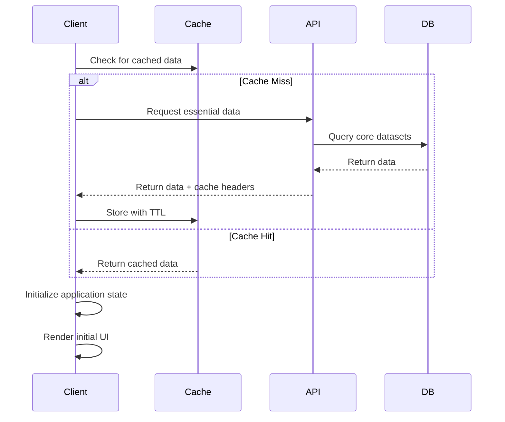
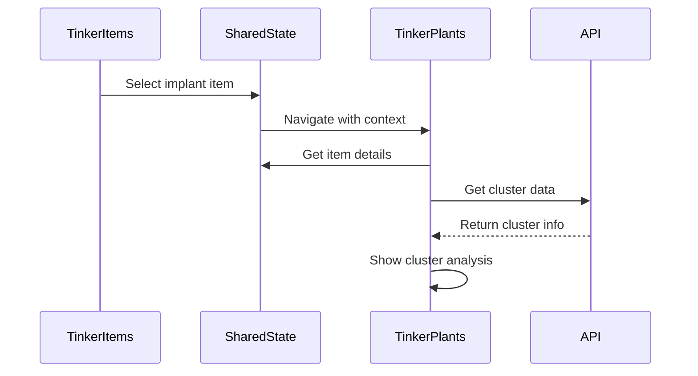
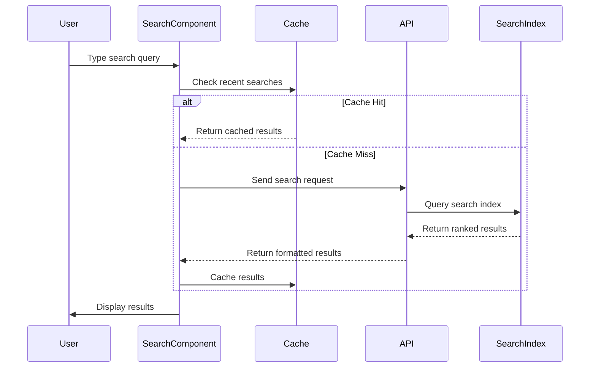
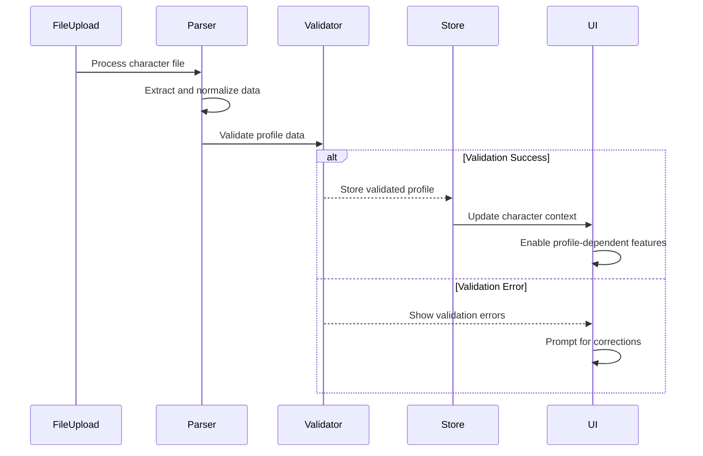

# TinkerTools API Design and Data Flow Architecture

## Overview

This document defines the API architecture, data flow patterns, and integration mechanisms for the TinkerTools suite. The design emphasizes performance, scalability, and seamless cross-application workflows while maintaining data consistency and security.

## API Architecture

### Core Design Principles

- **RESTful Design**: Standard HTTP methods with resource-based URLs
- **Client-Centric Processing**: Minimize server load with intelligent client-side operations
- **Batch Operations**: Efficient bulk data retrieval and updates
- **Caching Strategy**: Multi-level caching for optimal performance
- **Type Safety**: TypeScript interfaces for all API contracts
- **Error Handling**: Comprehensive error responses with actionable messages

### Base API Structure

```typescript
// Base API Configuration
const API_BASE_URL = process.env.VITE_API_BASE_URL || 'https://ao.tinkeringidiot.com/api'
const API_VERSION = 'v1'

// Standard Response Format
interface ApiResponse<T> {
  success: boolean
  data?: T
  error?: {
    code: string
    message: string
    details?: any
  }
  meta?: {
    timestamp: string
    requestId: string
    version: string
  }
}

// Pagination Interface
interface PaginatedResponse<T> extends ApiResponse<T[]> {
  pagination: {
    page: number
    limit: number
    total: number
    hasNext: boolean
    hasPrev: boolean
  }
}
```

## Core API Endpoints

### 1. Items API (`/api/v1/items`)

**Primary Functions**: Item search, retrieval, and metadata

```typescript
// GET /api/v1/items
interface ItemSearchQuery {
  search?: string
  category?: string[]
  subcategory?: string[]
  minQL?: number
  maxQL?: number
  profession?: string[]
  expansion?: string[]
  tags?: string[]
  page?: number
  limit?: number
  sort?: 'name' | 'ql' | 'category' | 'relevance'
  sortOrder?: 'asc' | 'desc'
}

// GET /api/v1/items/{id}
interface ItemDetailResponse {
  item: Item
  relatedItems: Item[]
  usageStats: {
    popularBuilds: string[]
    compatibleProfessions: string[]
    averageQL: number
  }
}

// POST /api/v1/items/batch
interface BatchItemRequest {
  itemIds: number[]
  includeStats?: boolean
  includeRelated?: boolean
}

// GET /api/v1/items/categories
interface CategoryTree {
  id: string
  name: string
  description: string
  children: CategoryTree[]
  itemCount: number
}
```

### 2. Nanos API (`/api/v1/nanos`)

**Primary Functions**: Nano program data and casting analysis

```typescript
// GET /api/v1/nanos
interface NanoSearchQuery {
  search?: string
  profession?: string[]
  school?: string[]
  strain?: string[]
  minNanoLevel?: number
  maxNanoLevel?: number
  effects?: string[]
  castingRequirements?: boolean
  page?: number
  limit?: number
}

// GET /api/v1/nanos/{id}/casting-analysis
interface CastingAnalysisRequest {
  characterStats: CharacterStats
  equipment?: EquipmentSet
  buffState?: BuffState
}

interface CastingAnalysisResponse {
  canCast: boolean
  requirements: {
    met: CastingRequirement[]
    missing: CastingRequirement[]
    marginal: CastingRequirement[]
  }
  recommendations: {
    equipment: Item[]
    buffs: Nano[]
    skills: SkillBoost[]
  }
}

// POST /api/v1/nanos/lineup-optimization
interface LineupOptimizationRequest {
  characterId: string
  nanoIds: number[]
  priorities: OptimizationPriority[]
  constraints: OptimizationConstraint[]
}
```

### 3. Symbiants API (`/api/v1/symbiants`)

**Primary Functions**: Symbiant data and build optimization

```typescript
// GET /api/v1/symbiants
interface SymbiantSearchQuery {
  search?: string
  slot?: SymbiantSlot[]
  unit?: SymbiantUnit[]
  expansion?: string[]
  bossLocation?: string[]
  minQL?: number
  maxQL?: number
}

// POST /api/v1/symbiants/build-optimization
interface SymbiantBuildRequest {
  characterStats: CharacterStats
  targetBuild: TargetBuild
  constraints: BuildConstraint[]
  priorities: BuildPriority[]
}

interface SymbiantBuildResponse {
  optimizedSet: SymbiantSet
  alternatives: SymbiantSet[]
  conflicts: ConflictAnalysis[]
  progression: ProgressionPlan[]
}
```

### 4. Damage Calculation API (`/api/v1/damage`)

**Primary Functions**: Combat calculations and analysis

```typescript
// POST /api/v1/damage/weapon-analysis
interface WeaponDamageRequest {
  weapon: Weapon
  character: CharacterStats
  target: TargetStats
  environment: CombatEnvironment
  buffs: BuffState[]
}

interface WeaponDamageResponse {
  baseDamage: DamageRange
  modifiedDamage: DamageRange
  criticalDamage: DamageRange
  dps: number
  accuracy: number
  breakdown: DamageBreakdown
}

// POST /api/v1/damage/nano-analysis
interface NanoDamageRequest {
  nano: Nano
  caster: CharacterStats
  target: TargetStats
  environment: CombatEnvironment
}

// POST /api/v1/damage/comparison
interface DamageComparisonRequest {
  items: (Weapon | Nano)[]
  character: CharacterStats
  scenarios: CombatScenario[]
}
```

### 5. Character Profiles API (`/api/v1/profiles`)

**Primary Functions**: Character data management (client-side focused)

```typescript
// POST /api/v1/profiles/validate
interface ProfileValidationRequest {
  profile: TinkerProfile
  strict?: boolean
}

interface ProfileValidationResponse {
  valid: boolean
  errors: ValidationError[]
  warnings: ValidationWarning[]
  suggestions: ProfileSuggestion[]
}

// POST /api/v1/profiles/compatibility
interface CompatibilityCheckRequest {
  profile: TinkerProfile
  items: Item[]
  context: 'equipment' | 'nano' | 'implant'
}

interface CompatibilityResponse {
  compatible: CompatibilityResult[]
  incompatible: CompatibilityResult[]
  recommendations: Item[]
}
```

### 6. Build Management API (`/api/v1/builds`)

**Primary Functions**: Build sharing and templates (optional server feature)

```typescript
// GET /api/v1/builds/templates
interface BuildTemplate {
  id: string
  name: string
  description: string
  profession: string
  level: number
  category: string
  components: BuildComponent[]
  metadata: BuildMetadata
}

// POST /api/v1/builds/analyze
interface BuildAnalysisRequest {
  build: ComplexBuild
  analysisType: 'optimization' | 'conflicts' | 'progression' | 'cost'
}

interface BuildAnalysisResponse {
  score: number
  strengths: string[]
  weaknesses: string[]
  optimizations: Optimization[]
  alternatives: AlternativeComponent[]
}
```

## Data Flow Patterns

### 1. Application Initialization Flow



### 2. Cross-Application Integration Flow



### 3. Real-time Search Flow



### 4. Character Profile Processing Flow



## Caching Strategy

### 1. Client-Side Caching

```typescript
// Cache Configuration
interface CacheConfig {
  staticData: {
    ttl: 24 * 60 * 60 * 1000 // 24 hours
    keys: ['items', 'nanos', 'categories']
  }
  dynamicData: {
    ttl: 5 * 60 * 1000 // 5 minutes
    keys: ['search-results', 'calculations']
  }
  userData: {
    ttl: Infinity // Until manual refresh
    keys: ['profiles', 'preferences', 'builds']
  }
}

// Cache Implementation
class ApiCache {
  private cache = new Map<string, CacheEntry>()
  
  async get<T>(key: string): Promise<T | null> {
    const entry = this.cache.get(key)
    if (!entry || entry.expiry < Date.now()) {
      this.cache.delete(key)
      return null
    }
    return entry.data
  }
  
  set<T>(key: string, data: T, ttl: number): void {
    this.cache.set(key, {
      data,
      expiry: Date.now() + ttl,
      timestamp: Date.now()
    })
  }
}
```

### 2. HTTP Caching Headers

```typescript
// API Response Headers
const cacheHeaders = {
  staticData: {
    'Cache-Control': 'public, max-age=86400', // 24 hours
    'ETag': 'generated-etag-hash',
    'Last-Modified': 'RFC-2822-date'
  },
  dynamicData: {
    'Cache-Control': 'public, max-age=300', // 5 minutes
    'ETag': 'calculation-specific-hash'
  },
  userSpecific: {
    'Cache-Control': 'private, no-cache',
    'Pragma': 'no-cache'
  }
}
```

## Error Handling

### 1. API Error Responses

```typescript
// Standard Error Format
interface ApiError {
  code: string
  message: string
  details?: {
    field?: string
    constraint?: string
    suggestion?: string
  }
  timestamp: string
  requestId: string
}

// Error Code Categories
enum ErrorCodes {
  // Client Errors (4xx)
  INVALID_REQUEST = 'INVALID_REQUEST',
  UNAUTHORIZED = 'UNAUTHORIZED',
  FORBIDDEN = 'FORBIDDEN',
  NOT_FOUND = 'NOT_FOUND',
  VALIDATION_ERROR = 'VALIDATION_ERROR',
  RATE_LIMITED = 'RATE_LIMITED',
  
  // Server Errors (5xx)
  INTERNAL_ERROR = 'INTERNAL_ERROR',
  SERVICE_UNAVAILABLE = 'SERVICE_UNAVAILABLE',
  TIMEOUT = 'TIMEOUT',
  DATABASE_ERROR = 'DATABASE_ERROR'
}
```

### 2. Client Error Handling

```typescript
// Error Handler Implementation
class ApiErrorHandler {
  static handle(error: ApiError): UserFriendlyError {
    switch (error.code) {
      case ErrorCodes.VALIDATION_ERROR:
        return {
          type: 'warning',
          title: 'Invalid Input',
          message: error.message,
          action: 'Please check your input and try again',
          recoverable: true
        }
      
      case ErrorCodes.NOT_FOUND:
        return {
          type: 'info',
          title: 'Not Found',
          message: 'The requested item could not be found',
          action: 'Try refining your search criteria',
          recoverable: true
        }
      
      case ErrorCodes.RATE_LIMITED:
        return {
          type: 'warning',
          title: 'Too Many Requests',
          message: 'Please wait a moment before trying again',
          action: 'Retry in a few seconds',
          recoverable: true,
          retryAfter: 5000
        }
      
      default:
        return {
          type: 'error',
          title: 'Unexpected Error',
          message: 'Something went wrong. Please try again.',
          action: 'Contact support if the problem persists',
          recoverable: false
        }
    }
  }
}
```

## Performance Optimization

### 1. Request Batching

```typescript
// Batch Request Handler
class BatchRequestManager {
  private pendingRequests = new Map<string, PendingBatch>()
  
  async batchItems(itemIds: number[]): Promise<Item[]> {
    const batchKey = 'items'
    const existing = this.pendingRequests.get(batchKey)
    
    if (existing) {
      existing.itemIds.push(...itemIds)
      return existing.promise
    }
    
    const batch: PendingBatch = {
      itemIds: [...itemIds],
      promise: this.executeBatch(batchKey)
    }
    
    this.pendingRequests.set(batchKey, batch)
    
    // Execute batch after short delay to collect more requests
    setTimeout(() => this.executeBatch(batchKey), 10)
    
    return batch.promise
  }
}
```

### 2. Response Compression

```typescript
// Client-side decompression for large datasets
class CompressionHandler {
  static async decompress(response: Response): Promise<any> {
    const encoding = response.headers.get('content-encoding')
    
    if (encoding === 'gzip') {
      const stream = response.body?.pipeThrough(new DecompressionStream('gzip'))
      return new Response(stream).json()
    }
    
    return response.json()
  }
}
```

## Security Considerations

### 1. API Security

```typescript
// Request Security
interface SecurityHeaders {
  'X-Request-ID': string
  'X-Client-Version': string
  'X-Client-Fingerprint': string
  'Content-Type': 'application/json'
}

// Rate Limiting (server-side)
interface RateLimit {
  windowMs: 15 * 60 * 1000 // 15 minutes
  maxRequests: 1000
  skipSuccessfulRequests: false
  keyGenerator: (req: Request) => string
}
```

### 2. Data Validation

```typescript
// Input Sanitization
class InputValidator {
  static sanitizeSearchQuery(query: string): string {
    return query
      .replace(/[<>]/g, '') // Remove HTML brackets
      .replace(/['"]/g, '') // Remove quotes
      .trim()
      .substring(0, 100) // Limit length
  }
  
  static validateItemId(id: any): number {
    const parsed = parseInt(id, 10)
    if (isNaN(parsed) || parsed < 1 || parsed > 1000000) {
      throw new Error('Invalid item ID')
    }
    return parsed
  }
}
```

## Integration Patterns

### 1. Cross-Application State Sharing

```typescript
// Shared State Management
interface SharedApplicationState {
  selectedCharacter: TinkerProfile | null
  selectedItems: Item[]
  crossAppContext: {
    sourceApp: string
    targetApp: string
    contextData: any
  }
  globalFilters: {
    expansion: string[]
    profession: string[]
    level: number
  }
}

// State Synchronization
class StateSync {
  static syncToApp(targetApp: string, context: any): void {
    window.postMessage({
      type: 'TINKERTOOLS_STATE_SYNC',
      targetApp,
      context,
      timestamp: Date.now()
    }, window.location.origin)
  }
}
```

### 2. Deep Linking and Navigation

```typescript
// Deep Link Handler
interface DeepLinkContext {
  app: string
  action: string
  params: Record<string, any>
  metadata: {
    sourceApp?: string
    timestamp: number
  }
}

class DeepLinkHandler {
  static generateLink(context: DeepLinkContext): string {
    const encoded = btoa(JSON.stringify(context))
    return `${window.location.origin}/#/link/${encoded}`
  }
  
  static parseLink(link: string): DeepLinkContext | null {
    try {
      const encoded = link.split('/link/')[1]
      return JSON.parse(atob(encoded))
    } catch {
      return null
    }
  }
}
```

## Development and Testing APIs

### 1. Mock API Server

```typescript
// Development Mock Server
class MockApiServer {
  private static mockData = {
    items: generateMockItems(10000),
    nanos: generateMockNanos(5000),
    symbiants: generateMockSymbiants(500)
  }
  
  static async handleRequest(path: string, params: any): Promise<any> {
    await this.simulateLatency()
    
    switch (path) {
      case '/api/v1/items':
        return this.filterItems(params)
      case '/api/v1/nanos':
        return this.filterNanos(params)
      default:
        throw new Error(`Mock endpoint not implemented: ${path}`)
    }
  }
  
  private static async simulateLatency(): Promise<void> {
    const delay = Math.random() * 200 + 50 // 50-250ms
    await new Promise(resolve => setTimeout(resolve, delay))
  }
}
```

### 2. API Testing Utilities

```typescript
// Test Helpers
class ApiTestUtils {
  static createMockResponse<T>(data: T): ApiResponse<T> {
    return {
      success: true,
      data,
      meta: {
        timestamp: new Date().toISOString(),
        requestId: 'test-' + Math.random().toString(36).substr(2, 9),
        version: 'v1'
      }
    }
  }
  
  static createMockError(code: string, message: string): ApiResponse<never> {
    return {
      success: false,
      error: {
        code,
        message,
        details: { source: 'test' }
      },
      meta: {
        timestamp: new Date().toISOString(),
        requestId: 'test-error',
        version: 'v1'
      }
    }
  }
}
```

## Summary

This API design provides:

1. **Comprehensive Coverage**: APIs for all TinkerTools applications
2. **Performance Focus**: Caching, batching, and optimization strategies
3. **Type Safety**: Full TypeScript interface definitions
4. **Error Resilience**: Robust error handling and recovery
5. **Integration Support**: Cross-application workflows and state management
6. **Developer Experience**: Mock servers and testing utilities
7. **Security**: Input validation and rate limiting
8. **Scalability**: Efficient data flow patterns

The design balances client-side processing capabilities with server-side efficiency, ensuring optimal performance while maintaining data consistency across the entire TinkerTools suite.